# Experient Platform Guide — Architecture, Flows & Scenarios

**Version:** 2.0 · **Updated:** 2026-06-03  
**Audience:** Engineers, PMs, and anyone who wants to understand how the platform works end-to-end.  
**Canonical location:** [`docs/platform/PLATFORM_GUIDE.md`](../../docs/platform/PLATFORM_GUIDE.md)

---

## Table of Contents

1. [System Architecture](#1-system-architecture)
2. [Survey Creation Flow](#2-survey-creation-flow)
3. [Publish & Response Collection](#3-publish--response-collection)
4. [Insight Pipeline — 12-Node DAG](#4-insight-pipeline--12-node-dag)
5. [Crystal Q&A — Streaming AI Analyst](#5-crystal-qa--streaming-ai-analyst)
6. [Crystal Action Tools](#6-crystal-action-tools)
7. [Action Recommendations System](#7-action-recommendations-system)
8. [Copilot Chat Editing](#8-copilot-chat-editing)
9. [Templates & Workflows](#9-templates--workflows)
10. [CrystalOS Skill Framework](#10-crystalos-skill-framework)
11. [Memory & Context Management](#11-memory--context-management)
12. [Data Model Overview](#12-data-model-overview)

---

## 1. System Architecture

The platform has three layers. The frontend never talks to CrystalOS directly — everything goes through the backend, which acts as auth gatekeeper and data layer.

```
┌──────────────────────────────────────────────────────────────────┐
│                      REACT APP  :5173                            │
│                                                                  │
│  Survey Builder  ·  Insights Page  ·  Crystal Panel             │
│  Template Library  ·  Workflow Studio  ·  Analytics             │
│                                                                  │
│  api.ts — Clerk JWT auto-injected on every request              │
└──────────────────────────┬───────────────────────────────────────┘
                           │  REST + SSE
                           │  Authorization: Bearer <JWT>
┌──────────────────────────▼───────────────────────────────────────┐
│                   NODE.JS BACKEND  :3001                         │
│                                                                  │
│  Auth     · Clerk JWT verify  · org/user extraction             │
│  Data     · Postgres pool     · Redis rate limiter              │
│  Proxy    · agentsClient.js   · X-Internal-Key                  │
│                                                                  │
│  Routes: surveys · responses · insights · copilot · experience  │
└──────────────────────────┬───────────────────────────────────────┘
                           │  HTTP  X-Internal-Key
                           │  (never exposed to browser)
┌──────────────────────────▼───────────────────────────────────────┐
│                    CRYSTALOS  :8001                              │
│                                                                  │
│  LangGraph DAG (12 nodes)    ←  insight pipeline               │
│  Crystal ReAct loop          ←  Q&A + action tools             │
│  Skill Registry + Runtime    ←  26 SKILL.md skills             │
│  12 XM Specialist Advisors   ←  action recommendations         │
│                                                                  │
│  Memory  L0 cache · L1 Redis · L2 compression · L3 facts · L4  │
│  Observe  tracer · hallucination_scorer · pii_scrubber          │
└──────────────────────────────────────────────────────────────────┘
          │               │               │
     Postgres          Redis          OpenRouter
   (insights,        (cache,          (LLM API)
   responses,        streams,
   threads)          rate-limit)
```

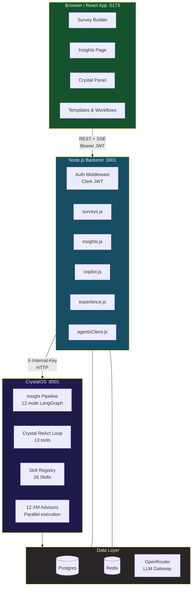

---

## 2. Survey Creation Flow

**Real-life scenario:** Rachel (VP of CX) types an intent — "I want to measure how likely enterprise customers are to recommend us after 90-day onboarding" — and gets a complete, QC-approved survey in ~15 seconds.

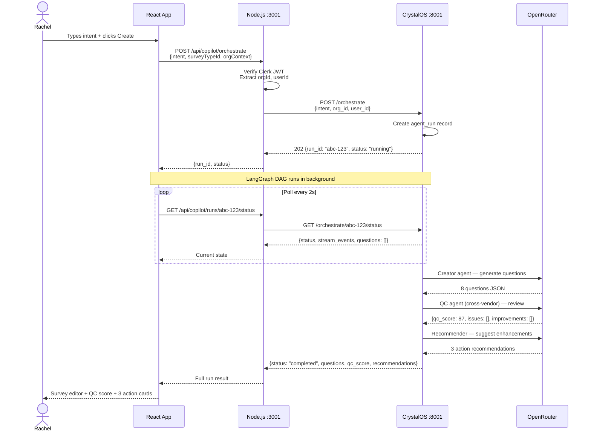

**What CrystalOS runs (in order):**

```
orchestrate/
  1. survey_creator_agent    → generates initial questions from intent
  2. quality_control_agent   → cross-vendor QC (creator=DeepSeek → QC=Gemini)
  3. compliance_agent        → GDPR data minimization, accessibility check
  4. recommender_agent       → 3 improvement action suggestions
```

**Key behaviors:**
- Cross-vendor QC prevents model self-confirmation bias (creator and QC always use different vendors)
- `USE_SKILL_RUNTIME=true` → creator step delegates to `survey-creator` CrystalOS skill
- QC score ≥ 70 = passes; below triggers automatic fix suggestions
- Run result stays alive in `agent_runs` table for copilot editing (next scenario)

---

## 3. Publish & Response Collection

**Real-life scenario:** Rachel publishes the survey. 847 enterprise customers fill it out over 3 months, triggering progressive insight tiers automatically.

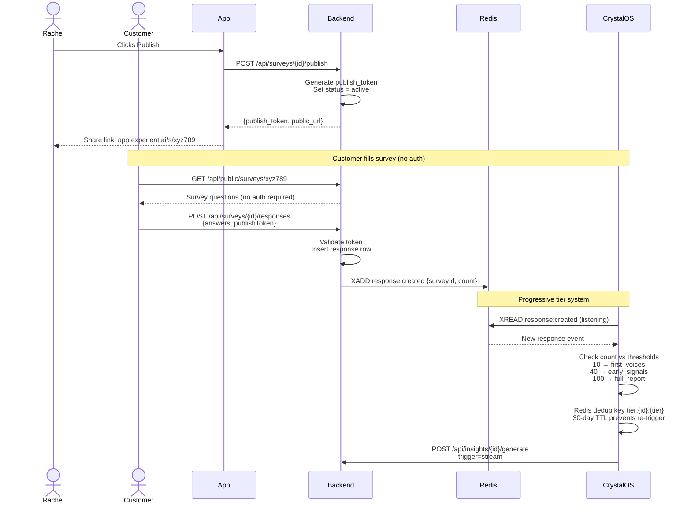

**Tier thresholds** (configurable in `constants.py`):

| Responses | Tier | What runs |
|-----------|------|-----------|
| 10 | `first_voices` | Topic discovery only, no narrative |
| 40 | `early_signals` | Topics + basic metrics |
| 100 | `full_report` | Full 12-node pipeline |
| 250 | `growing_picture` | Full pipeline + trend analysis |

---

## 4. Insight Pipeline — 12-Node DAG

**Real-life scenario:** After 150 responses, Rachel clicks "Generate Insights". The pipeline runs in ~45 seconds and produces 8 insight cards with trust scores, citations, and recommended actions.

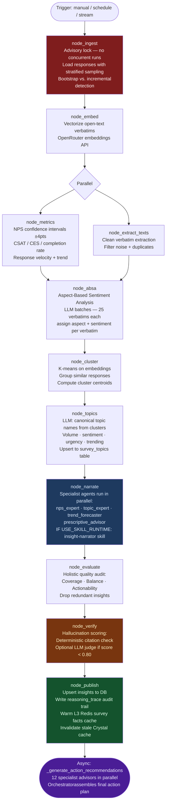

**What each insight looks like** in the DB (and on screen):

```json
{
  "layer": "diagnostic",
  "category": "voice.diagnostic",
  "headline": "Onboarding friction drives 61% of detractors — setup complexity is the #1 pain point",
  "narrative": "43% of detractors mention 'setup complexity' or 'took too long' with sentiment -0.72 — the lowest of any topic. Verbatims show frustration concentrated in the account configuration step.",
  "trust_score": 84,
  "trust_json": {
    "statistical": 88,
    "coverage": 82,
    "consistency": 79,
    "grounding": 100,
    "sample_size": 150
  },
  "citations_json": [
    {"quote": "Took 3 weeks just to set up the basic integrations"},
    {"quote": "The configuration guide was outdated and confusing"}
  ],
  "reasoning_trace": {
    "hallucination_score": 0.94,
    "eval_score": 0.87,
    "model": "google/gemini-2.5-flash",
    "schema_version": 1
  }
}
```

**Trust score thresholds:**
- ≥ 80 → **Reliable** (emerald badge) — statistically strong, grounded, consistent
- 60–79 → **Indicative** (amber badge) — directional, worth acting on
- < 60 → **Low-signal** (gray badge) — flag for more data

---

## 5. Crystal Q&A — Streaming AI Analyst

**Real-life scenario:** Rachel asks "Why did NPS drop 8 points last month?" and watches Crystal think in real time, calling tools to look up the answer before synthesizing.

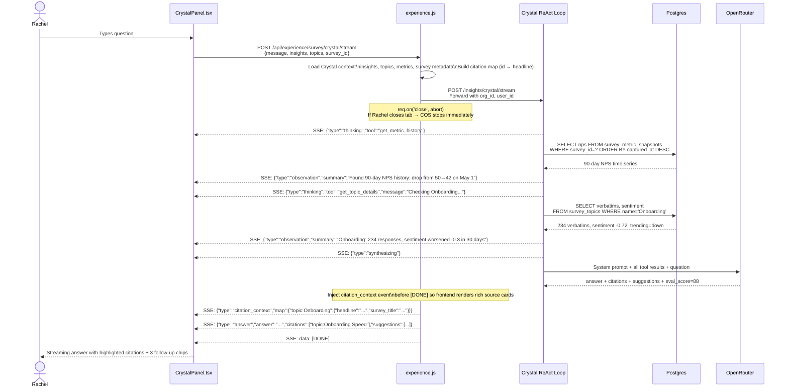

**The 13 Crystal tools** (all read-only, `crystalos/crystal/registry.py`):

```
Data tools:
  get_survey_overview     → response count, NPS/CSAT scores, top topics
  get_topic_details       → verbatims + sentiment breakdown for one topic
  get_metric_history      → NPS/CSAT/CES time series (90-day default)
  get_insights_list       → AI insights filtered by layer/window
  get_verbatims           → raw verbatims by topic + sentiment
  get_benchmark_comparison → vs Satmetrix industry benchmarks
  get_driver_analysis     → NPS/CSAT drivers ranked by impact (-100 to +100)
  get_segment_breakdown   → responses broken down by question answer
  get_checkpoint_history  → snapshot history, metric changes over time
  compare_surveys         → side-by-side metric + theme comparison
  get_org_portfolio       → all surveys in org with aggregate metrics
  get_cross_survey_themes → themes appearing across multiple surveys
  get_anomaly_events      → flagged metric drops across surveys

Action proposal tools:
  recommend_next_actions  → calls action-recommender skill (12 specialists)
  propose_survey_creation → structured survey creation proposal
  propose_survey_edit     → question addition/modification proposal
  propose_distribution    → targeted distribution campaign proposal
  propose_workflow        → automation workflow proposal
  list_relevant_templates → template library search
```

**Memory system** keeps Crystal efficient across turns:

```
Before Crystal responds — context assembled:
  L4 Org memory   → "This user always wants bullet points" (pgvector)
  L2 Thread state → compressed decisions from earlier in conversation (~200 tokens)
  Raw turns       → last 2 messages verbatim
  L3 Survey facts → NPS=42, top 5 topics, response_count=150 (Redis, warmed at publish)
  Current message → Rachel's question

Token budget: ~2,000 (vs 5,000+ without memory layer) — 60% reduction
```

---

## 6. Crystal Action Tools

**Real-life scenario:** Rachel asks "What are my top 3 action items this week?" Crystal calls `recommend_next_actions`, which triggers all 12 XM specialist advisors in parallel, then proposes confirmed actions as interactive cards.

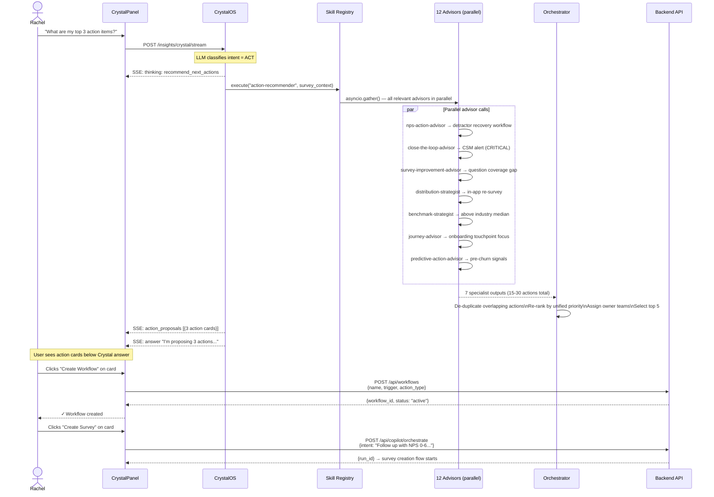

**Safety guarantee:** Crystal **never** executes write operations autonomously. Every action tool returns a **proposal** that requires explicit user confirmation. The `requires_confirmation: true` flag is always set.

```
Action proposal types → what the frontend calls:
  create_followup_survey  → api.startRun({ intent, surveyTypeId })
  edit_survey_questions   → api.copilotRefine(runId, { message })
  distribute_to_segment   → navigate to /surveys/{id}/build?tab=distribute
  create_workflow         → api.createWorkflow({ name, trigger, ... })
  schedule_rerun          → api.triggerInsightGeneration(surveyId)
  view_template           → navigate to /templates
```

---

## 7. Action Recommendations System

**Real-life scenario:** After the pipeline publishes insights, 12 specialist advisors run in parallel without Rachel doing anything. She sees a prioritized action panel on the insights page the next time she opens it.

```mermaid
flowchart LR
    PUBLISH[node_publish\ncompletes] -->|asyncio.create_task| ASYNC

    subgraph ASYNC["Action Recommendations (async, non-blocking)"]
        direction TB
        CTX[Build survey context\nNPS/CSAT/CES metrics\nTop 8 themes\nKey insights]

        CTX --> GATHER["asyncio.gather() — 12 advisors in parallel"]

        subgraph METRIC["Metric Advisors"]
            NPS[nps-action-advisor\nDetector recovery\nPassive conversion\nPromoter amplification]
            CES[ces-action-advisor\nFriction elimination\nProcess redesign\nChannel optimization]
            CSAT[csat-action-advisor\nTop-box optimization\nDissatisfier elimination]
            ENPS[enps-action-advisor\nManager coaching\nRetention programs\nCulture audit]
        end

        subgraph ACTION["Action Execution Advisors"]
            CTL[close-the-loop-advisor\nWho to contact\nWhat to say\nWhen to escalate]
            PRED[predictive-action-advisor\nPre-churn signals\nLeading indicators\nProactive intervention]
        end

        subgraph PROGRAM["Program Design Advisors"]
            SI[survey-improvement-advisor\nCoverage gaps\nSkip logic opportunities\nQuestion quality]
            DS[distribution-strategist\nChannel selection\nSegment targeting\nTiming optimization]
        end

        subgraph STRATEGIC["Strategic Advisors"]
            BENCH[benchmark-strategist\nCompetitive positioning\nInvestment priority]
            VOC[voc-program-advisor\nListening post coverage\nProgram maturity]
            SEG[segment-action-advisor\nEnterprise vs SMB\nNew vs tenured]
            JRN[journey-advisor\nTouchpoint interventions\nMoment-of-truth focus]
        end

        GATHER --> METRIC
        GATHER --> ACTION
        GATHER --> PROGRAM
        GATHER --> STRATEGIC

        METRIC --> ORC
        ACTION --> ORC
        PROGRAM --> ORC
        STRATEGIC --> ORC

        ORC[action-recommender v2\nOrchestrator\nDe-duplicate\nRe-rank unified priority\nAssign owners\nTop 5 actions]
    end

    ORC -->|INSERT ... ON CONFLICT DO UPDATE| DB[(action_recommendations\ntable)]
    DB -->|GET /api/insights/{id}/actions| UI[Insights Page\nAction Panel]

    style ASYNC fill:#1e1b4b,color:#e0e7ff
    style ORC fill:#7f1d1d,color:#fef2f2
    style DB fill:#14532d,color:#dcfce7
```

**Priority color coding in the UI:**
- 🔴 **Critical** — act within 24h (explicit churn signals, NPS < 0)
- 🟡 **High** — act this week (declining metric, missing close-the-loop)
- 🔵 **Medium** — act this month (survey quality gaps, distribution improvements)
- ⚪ **Low** — strategic (program maturity, benchmark positioning)

---

## 8. Copilot Chat Editing

**Real-life scenario:** Rachel types "Make the NPS question shorter" or "Add skip logic — only show the support question if they contacted support."

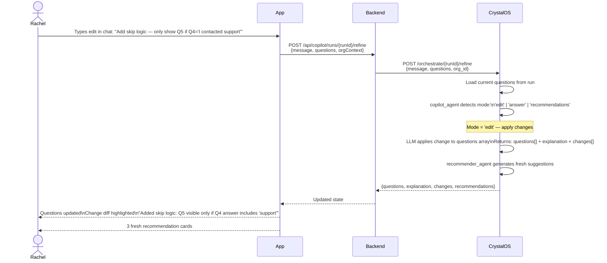

**What the copilot can do in a single message:**
- Rephrase any question (preserves type and intent)
- Add questions (positioned correctly, right type chosen)
- Remove questions (cleans up skip logic references)
- Reorder (full array reordered)
- Add/modify skip logic (plain English → structured condition)
- Change question type (open text → scale → multiple choice)
- Add answer options

---

## 9. Templates & Workflows

```mermaid
flowchart LR
    subgraph Templates["Template Library"]
        direction TB
        A[Admin creates template\nPOST /api/templates\nTitle + questions + metadata] --> B[(templates table)]
        B --> C[User browses\nGET /api/templates]
        C --> D[Clone → new survey\nPOST /api/templates/{id}/clone\nCreates draft copy]
    end

    subgraph Workflows["Workflow Automation"]
        direction TB
        E[User creates rule\nPOST /api/workflows\nTrigger + condition + action] --> F[(workflows table)]
        F --> G{Trigger type}
        G -->|response_count| H[Stream consumer\nCrystalOS watches Redis\nTier thresholds: 10/40/100/250]
        G -->|score_threshold| I[Backend check\nOn each response insert:\nif NPS < 5 → fire workflow]
        G -->|schedule| J[Scheduler\nCron job in crystalos/scheduler.py\nMonday 8am insight regeneration]
        H --> K[Action: POST /insights/generate]
        I --> L[Action: Slack / Email alert\nor trigger CrystalOS endpoint]
        J --> K
    end

    style Templates fill:#164e63,color:#e0f2fe
    style Workflows fill:#4a1d96,color:#ede9fe
```

**Three workflow trigger types:**

| Trigger | How it works | Common use |
|---------|-------------|------------|
| Response count | CrystalOS Redis stream consumer watches `response:created` events | Auto-generate insights at 10/40/100 responses |
| Score threshold | Backend checks on every response insert | Alert CSM when NPS < 5 |
| Schedule | `scheduler.py` cron job runs in CrystalOS | Weekly insight refresh every Monday |

---

## 10. CrystalOS Skill Framework

**The architecture that lets you add a new AI capability in one file.**

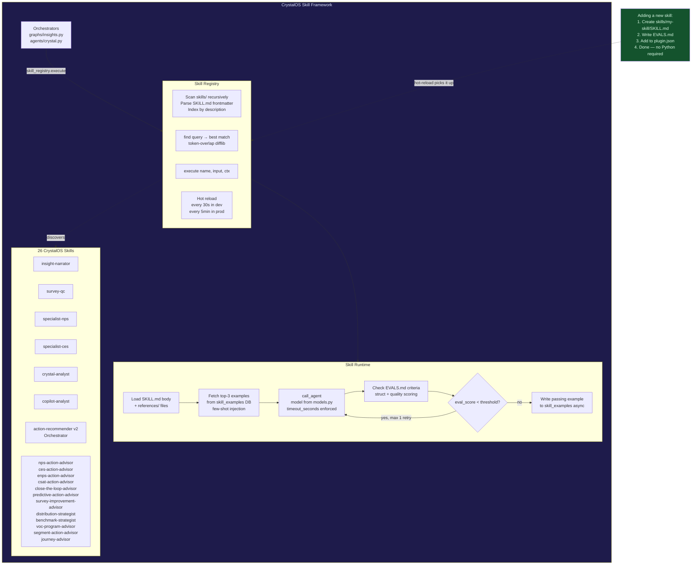

**SKILL.md structure** — the complete definition of one AI capability:

```
agents/skills/insight-narrator/
  SKILL.md           ← frontmatter (name, version, timeout, tools) + prompt body
  EVALS.md           ← quality criteria table (ID | Criterion | Weight | Threshold)
  EXAMPLES.md        ← human-readable view of DB examples (auto-generated)
  references/
    xm-best-practices.md  ← injected into system prompt automatically
```

**How a skill executes:**

```
1. Registry.execute("insight-narrator", input_data, ctx)
   ↓
2. Runtime: load SKILL.md body + references/ + top-3 few-shot examples from DB
   ↓
3. call_agent(system=assembled_prompt, user=json.dumps(input_data))
   ↓
4. Parse output as JSON
   ↓
5. Check EVALS.md: E1 (valid JSON) must pass · E3 (3-5 findings) >= 0.80 · ...
   ↓
6. eval_score >= 0.75? → write to skill_examples table (async)
   eval_score < 0.75? → retry once with failure context injected
   ↓
7. Return SkillResult {output, eval_score, eval_passed, retried, latency_ms}
```

---

## 11. Memory & Context Management

**Why this matters:** Without memory management, Crystal sends 5,000+ tokens of raw conversation history on every turn. With the 4-layer system, it sends ~1,200 tokens — 62% reduction with equal or better quality.

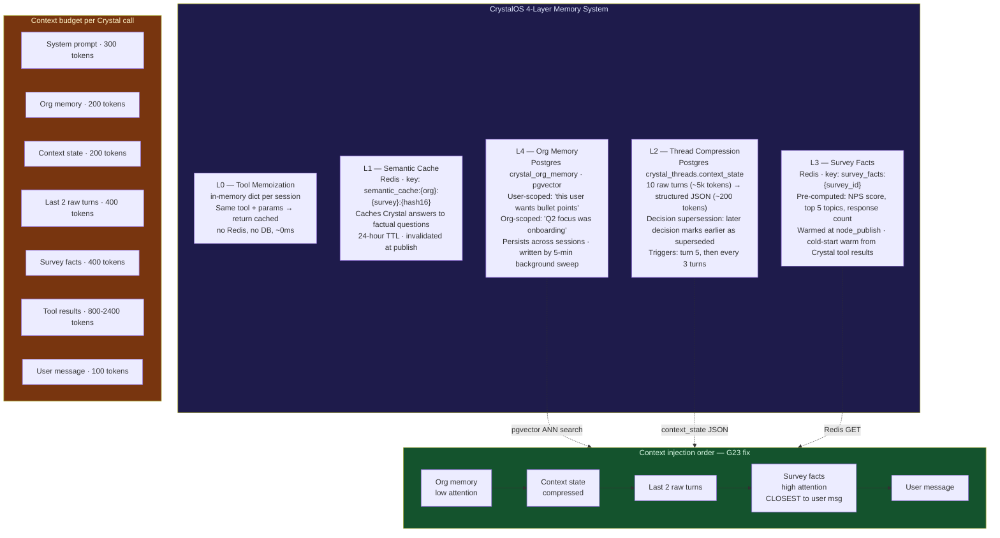

---

## 12. Data Model Overview

**The key tables and how they connect:**

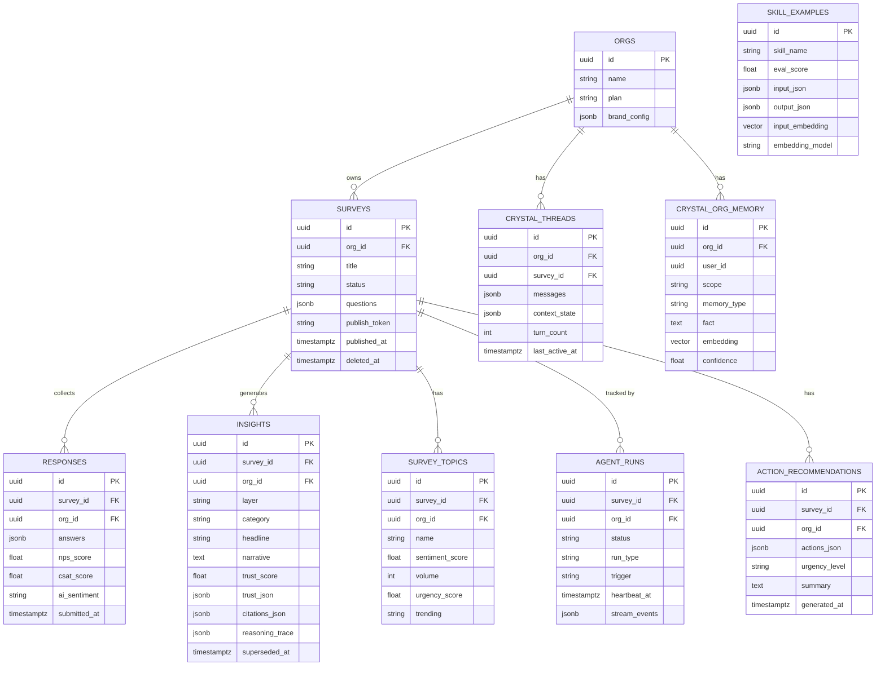

---

## Complete User Journey — Rachel's Day

Here's how all 8 flows connect in a single use case:

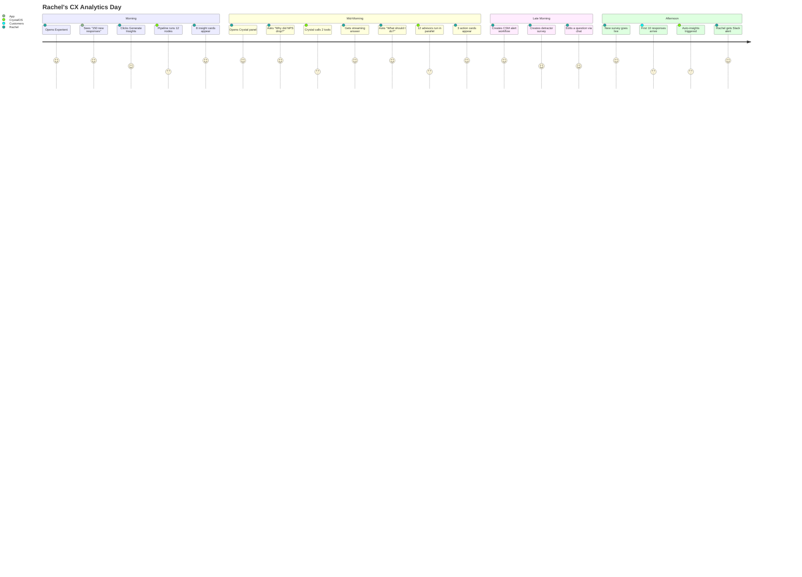

---

## Quick Reference — What Calls What

| User action | Frontend call | Backend route | CrystalOS endpoint | Key module |
|---|---|---|---|---|
| Create survey | `api.startRun()` | `POST /copilot/orchestrate` | `POST /orchestrate` | `creator_agent` |
| Edit via chat | `api.copilotRefine()` | `POST /copilot/runs/:id/refine` | `POST /orchestrate/:id/refine` | `copilot_agent` |
| Apply recommendation | `api.applyRecommendation()` | `POST /copilot/runs/:id/apply-recommendation/:actionId` | `POST /orchestrate/:id/apply-recommendation/:id` | `skip_logic_agent` etc. |
| Publish survey | `api.publishSurvey()` | `POST /surveys/:id/publish` | *(none)* | `surveys.js` |
| Submit response | *(public, no auth)* | `POST /surveys/:id/responses` | *(Redis stream → tier trigger)* | `responses.js` |
| Generate insights | `api.triggerInsightGeneration()` | `POST /insights/:id/generate` | `POST /insights/generate` | `graphs/insights.py` |
| Ask Crystal (REST) | `api.crystalChat2()` | `POST /experience/crystal` | `POST /insights/crystal` | `agents/crystal.py` |
| Ask Crystal (SSE) | *(fetch + ReadableStream)* | `POST /experience/:scope/crystal/stream` | `POST /insights/crystal/stream` | `agents/crystal.py` |
| Get action recs | `api.getActionRecommendations()` | `GET /insights/:id/actions` | *(async post-publish)* | `_generate_action_recommendations()` |
| Dismiss action | `api.dismissAction()` | `POST /insights/:id/actions/:actionId/dismiss` | *(none)* | `insights.js` |
| List templates | `api.listTemplates()` | `GET /templates` | *(none)* | `templates.js` |
| Create workflow | `api.createWorkflow()` | `POST /workflows` | *(none)* | `workflows.js` |

---

## Environment — Running Locally

```bash
# 1. Data layer
docker-compose up -d postgres redis

# 2. CrystalOS (AI service)
cd crystalos
cp env.example .env          # fill in OPENROUTER_API_KEY, DATABASE_URL, REDIS_URL
make run-dev                 # starts on :8001 with hot reload

# 3. Backend
cd backend
cp .env.example .env
npm start                    # starts on :3001

# 4. Frontend
cd app
npm run dev                  # starts on :5173

# 5. CrystalOS tests
cd crystalos
.venv/bin/pytest tests/ -q   # 612 tests, ~33 seconds
```

**Key environment variables:**

| Variable | Where | Purpose |
|---|---|---|
| `OPENROUTER_API_KEY` | `crystalos/.env` | LLM API access (required) |
| `DATABASE_URL` | both | Postgres connection |
| `REDIS_URL` | both | Redis (optional in dev, falls back gracefully) |
| `AGENTS_INTERNAL_KEY` | both | Backend ↔ CrystalOS auth (must match) |
| `AGENTS_ENV` | `crystalos/.env` | `dev` / `dev-paid` / `staging` / `prod` |
| `USE_SKILL_RUNTIME` | `crystalos/.env` | Enable CrystalOS skill framework (default: false) |
| `VITE_CRYSTAL_STREAMING` | `app/.env` | Enable SSE streaming for Crystal (default: false) |
| `SKIP_AUTH` | `backend/.env` | Bypass Clerk auth in local dev |

---

*Generated 2026-06-03 · CrystalOS v2.0 · 612 tests passing*
