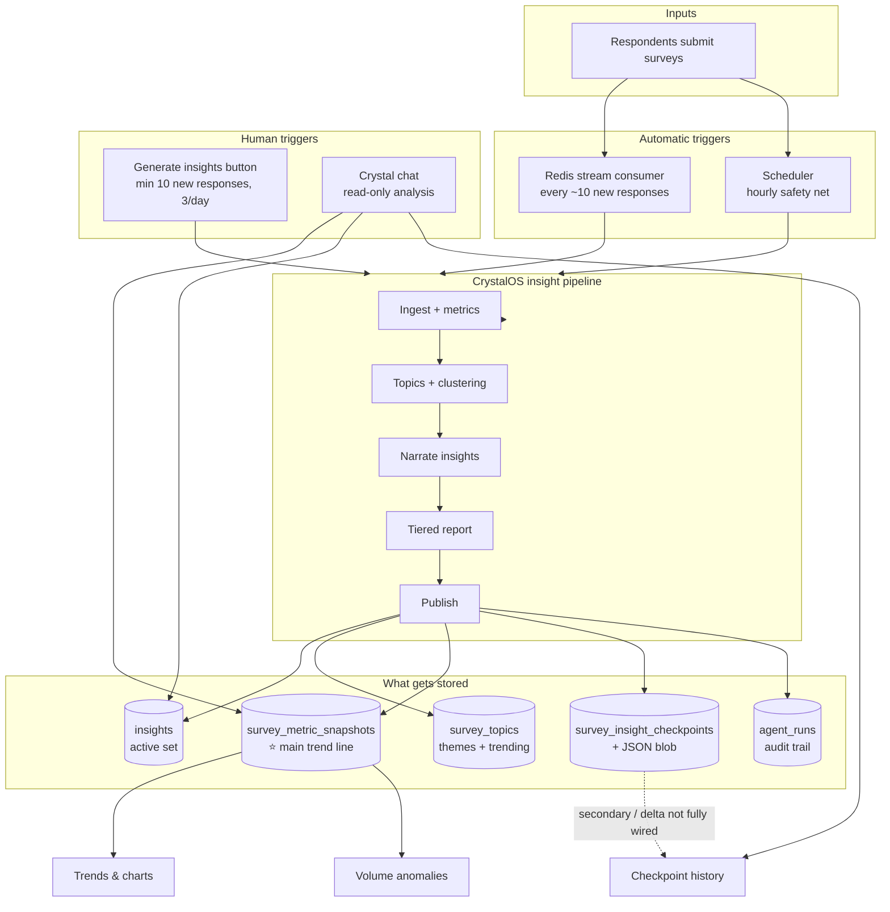
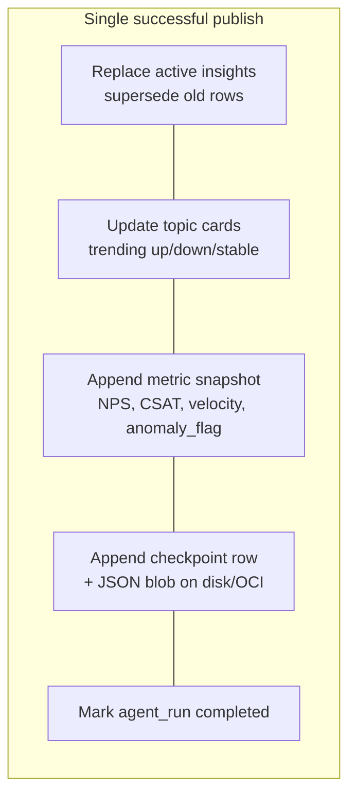
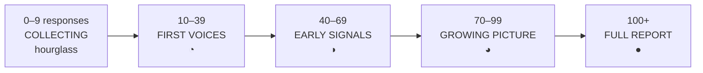
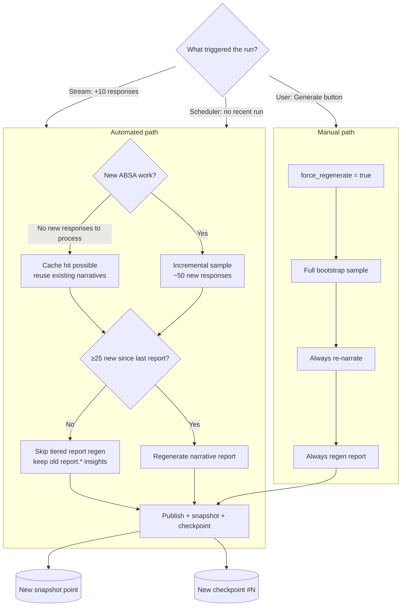
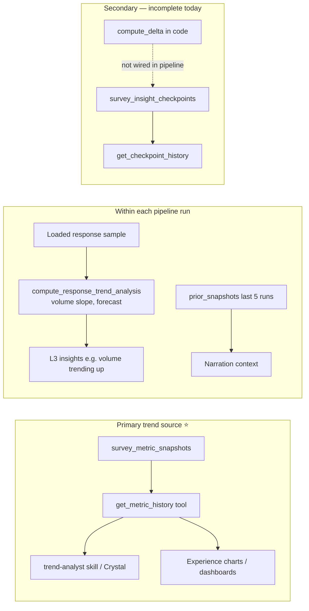
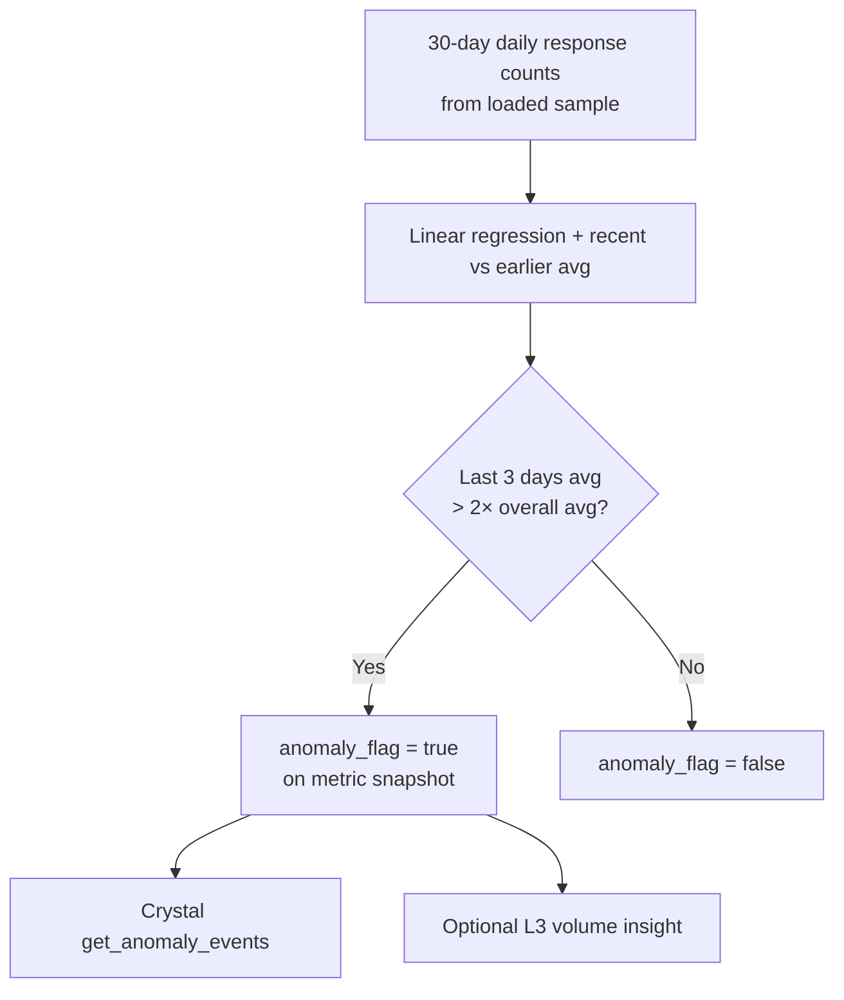
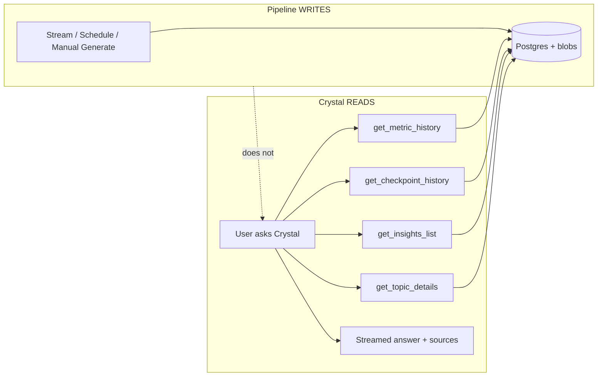
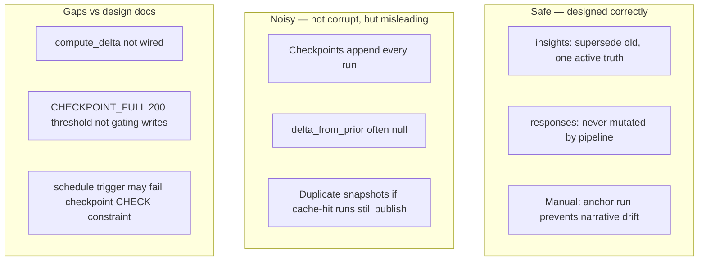

# Experient Intelligence Lifecycle — Visual Guide

> **Purpose:** One-page mental model for how surveys become insights, trends, anomalies, snapshots, and checkpoints over time.  
> **Audience:** Product, CX operators, engineers.  
> **Based on:** Current codebase behavior (June 2026), not aspirational docs.

---

## 1. The big picture (one diagram)



**Key takeaway:** Trends ride on **metric snapshots** (one dot per pipeline run). Checkpoints are **report photos** — useful history, but not the primary trend engine today.

---

## 2. What one pipeline run produces



| Artifact | Grows how? | Used for |
|----------|------------|----------|
| `insights` | Replace (supersede) | Intelligence page, Crystal citations |
| `survey_topics` | Upsert | Theme cards, trending badges |
| `survey_metric_snapshots` | **Append** | **Trends**, alerts, `get_metric_history` |
| `survey_insight_checkpoints` | **Append** | History, `get_checkpoint_history` |
| Checkpoint JSON blob | **Append** | Full report payload archive |

---

## 3. UI tier progression (what Acme sees)

Response count drives the **Survey Intelligence** banner:



**Auto-fired at milestones (stream):** 10 → 40 → 70 → 100 responses (once each, tracked in Redis).

After 100+, ongoing updates come from **stream (+10 responses)** and **scheduler**, not new tier badges.

---

## 4. Auto vs manual — decision tree



| | Automated | Manual |
|--|-----------|--------|
| Min gate | ~10 new responses (stream) | ≥10 new since last run + 3/day |
| Re-narrate if unchanged? | Often skips | Never skips |
| Report regen | Only if ≥25 new since last report | Always |
| Corrupts insights? | No — supersede pattern | No |
| Noisy checkpoint history? | Can be | Yes, if run often |

---

## 5. How trends are calculated



**Example trend line (happy path survey):**

```
NPS
 50 ┤                              ╭──
 45 ┤                    ╭─────────╯
 40 ┤          ╭─────────╯
 35 ┤    ╭─────╯
    └────┴────┴────┴────┴────┴────┴──► time
         W1   W2   W3   W4   W5   W6
         ↑ each tick = one survey_metric_snapshots row
```

---

## 6. How anomalies are calculated (today)



**Not yet:** automatic “NPS dropped 8 points” anomaly on every run (that’s **alert rules** comparing snapshots, if configured).

---

## 7. Scenario timelines

### 7a. Happy path — steady growth (Acme Support NPS)

```
Responses
 120 ┤                                    ╭──
  80 ┤                          ╭─────────╯
  40 ┤                ╭─────────╯  ↑ tier: early_signals (40)
  10 ┤      ╭─────────╯            ↑ tier: first_voices (10)
   0 ┼──────┴────────────────────────────────────────────► weeks
       launch                          full_report (100)

Automation:  ●    ●      ●       ●●●●●●●●  (stream every ~10)
Snapshots:   1    2      3       4..12     (one per publish)
UI tier:     collecting → first → early → growing → full ●
Crystal:     thin answers ────────────────► strong trends
```

**What they see:** Banner climbs tiers → topic cards populate → full report → Crystal answers “How is NPS trending?” with a real sparkline.

---

### 7b. Low response rate (Enterprise onboarding, ~3/week)

```
Responses
  15 ┤                              ╭─
  10 ┤                    ╭────────╯  ← first auto run (hit 10)
   5 ┤          ╭─────────╯
   0 ┼──────────┴──────────────────────────────► months
       Q1 trickle                    Q2 trickle

Automation:  ·  ·  ·  ·  ·  ●  ·  ·  ·  ·  (mostly quiet)
Scheduler:   ·  ·  ?  ·  ·  ·  ·  ·  ·  ·  (occasional backup)
Snapshots:   sparse — maybe 1 point / month
UI tier:     stuck in Collecting / First voices for weeks
Crystal:     honest “early signal / low n” answers
Anomalies:   unlikely (not enough daily volume)
```

**What they see:** Long “waiting for voices” phase. Intelligence feels stale until threshold finally hits. Manual Generate when 10 new responses accumulate.

---

### 7c. Constant firehose (~500 responses/day)

```
Responses/day
 500 ┤████████████████████████████████████████
 250 ┤
   0 ┼────────────────────────────────────────► days

Stream runs:     ~50/day possible (every 10 responses)
Snapshots:       dense — great trend charts
Report regen:    ~every 25 new responses (not every 10)
Checkpoints:     many rows — often similar NPS (noisy history)
Anomalies:       possible if volume suddenly doubles (spike)

UI:              full_report immediately, metrics feel “live”
Risk:            checkpoint list clutter (known gap)
```

---

### 7d. Analyst constantly working (Sarah, launch week)

```
        Mon      Tue      Wed      Thu      Fri
Stream  ●●●●     ●●●      ●●●●     ●●       ●●●     (auto)
Manual           ★                 ★★                (Sarah)
Crystal ~~~~ chat ~~~~ chat ~~~~ chat ~~~~ chat ~~~~  (read-only)

★ = manual Generate (needs ≥10 new responses, max 3/day)
~~~~ = Crystal uses snapshots + insights, no new pipeline

Effect:
  • Insights always fresh after ★
  • Snapshots get extra points on manual days
  • Checkpoints append faster — timeline gets dense
  • Insights NOT corrupted (supersede pattern)
  • Anchor run prevents “synthesis on synthesis” drift
```

---

## 8. Combination matrix

| Pattern | Stream | Manual | Trend quality | Checkpoint noise | Best for |
|---------|--------|--------|---------------|------------------|----------|
| Steady growth | High | Low | ★★★★★ | Low | Default happy path |
| Low volume | Rare | Occasional | ★☆☆☆☆ | Very low | Enterprise, niche surveys |
| Firehose | Very high | Low | ★★★★★ | High | In-app pulses |
| Launch spike → quiet | Spike then flat | Post-spike manual | ★★★☆☆ | Spike cluster | Campaigns |
| Analyst-heavy | Medium | High | ★★★★☆ | High | Exec reviews, workshops |
| Low + analyst | Rare | Rare | ★★☆☆☆ | Low | Patience required |
| Firehose + analyst | Very high | Daily ★ | ★★★★★ | Very high | War room / launch |

---

## 9. Crystal chat vs insight pipeline



**Crystal streaming** = how answers appear in the UI.  
**Response stream** = how new survey responses trigger insight generation.  
Different things.

---

## 10. Data safety model



---

## 11. Operator cheat sheet

```
┌─────────────────────────────────────────────────────────────────┐
│  WHEN WILL INSIGHTS AUTO-UPDATE?                                │
├─────────────────────────────────────────────────────────────────┤
│  • 10 new responses (prod) → stream fires pipeline              │
│  • Milestones 10 / 40 / 70 / 100 → extra progressive run        │
│  • Scheduler → if no run in last hour (backup)                  │
├─────────────────────────────────────────────────────────────────┤
│  WHEN WILL THE NARRATIVE REPORT REGEN? (automated)              │
├─────────────────────────────────────────────────────────────────┤
│  • Only when ≥25 new responses since last report.* insight       │
├─────────────────────────────────────────────────────────────────┤
│  WHEN CAN ANALYST FORCE REFRESH?                                │
├─────────────────────────────────────────────────────────────────┤
│  • Generate button: ≥10 new responses since last run, 3/day   │
│  • Always full re-narration + report                            │
├─────────────────────────────────────────────────────────────────┤
│  WHERE TO LOOK FOR TRENDS                                       │
├─────────────────────────────────────────────────────────────────┤
│  • Charts / Crystal → survey_metric_snapshots                   │
│  • NOT primarily checkpoint blobs (today)                       │
├─────────────────────────────────────────────────────────────────┤
│  ANOMALIES TODAY                                                │
├─────────────────────────────────────────────────────────────────┤
│  • Response volume spike (3-day avg > 2× 30-day avg)            │
│  • NPS drop alerts → separate alert rules (if configured)       │
└─────────────────────────────────────────────────────────────────┘
```

---

## 12. File map (code ↔ concept)

| Concept | Code / table |
|---------|----------------|
| Stream trigger | `crystalos/consumers/response_stream.py` |
| Scheduler | `crystalos/scheduler.py` |
| Pipeline publish | `crystalos/graphs/insights.py` → `node_publish` |
| Metric snapshots | `survey_metric_snapshots` |
| Checkpoints | `survey_insight_checkpoints` + `checkpoint_store.py` |
| Trend math (tools) | `crystalos/tools/delta.py` (exists, partial use) |
| Volume anomaly | `crystalos/tools/metrics.py` → `compute_response_trend_analysis` |
| Manual API | `backend/src/routes/insights.ts` → `POST /:surveyId/trigger` |
| UI tiers | `app/src/pages/experience/SurveyIntelligencePage.tsx` |

---

*Canonical copy: `docs/insights/`. Working copy also in `temp/docs/`.*
