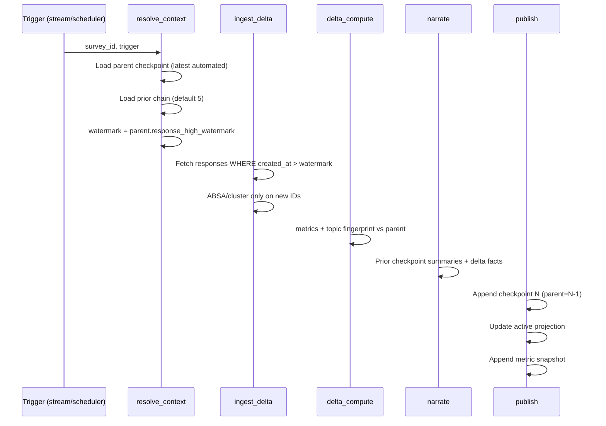

# Architecture — Insight Pipeline v2

> System design for **configurable, lineage-first** insight generation.  
> Aligns with [ENGINE_DECISIONS.md](../ENGINE_DECISIONS.md): one tool library, LLM narrates / code computes, streaming by default.

---

## 1. Logical architecture

```
┌─────────────────────────────────────────────────────────────────────────────┐
│                           CLIENT (React)                                     │
│  Intelligence Page │ Insight Trail │ Trends │ Crystal Panel                  │
│  Manual Run Dialog (Expert/Quick) │ Config (Settings → Insights)             │
└─────────────────────────────────────────────────────────────────────────────┘
                                      │ REST + SSE
                                      ▼
┌─────────────────────────────────────────────────────────────────────────────┐
│                      EXPRESS API (backend/src/routes/insights.ts)            │
│  GET  /insights/:surveyId/trail          — linked checkpoint list            │
│  GET  /insights/:surveyId/trail/:id      — checkpoint detail + lineage       │
│  POST /insights/:surveyId/runs           — manual run (mode, window)         │
│  GET  /insights/:surveyId/active         — projection of latest automated    │
│  GET  /insights/:surveyId/reports/:id    — manual report document            │
│  PATCH /insights/:surveyId/settings      — lookback, thresholds              │
└─────────────────────────────────────────────────────────────────────────────┘
                                      │ agentsClient (HMAC)
                                      ▼
┌─────────────────────────────────────────────────────────────────────────────┐
│                    CRYSTALOS — Insight Orchestrator                          │
│                                                                              │
│  run_insight_generation(profile, config)                                     │
│    profiles: automated_incremental | refresh | manual_expert | manual_quick │
│                                                                              │
│  ┌────────────────────────────────────────────────────────────────────────┐ │
│  │ LangGraph DAG (shared nodes, profile-gated edges)                       │ │
│  │                                                                         │ │
│  │  resolve_context → ingest → embed_delta → metrics → cluster_delta →    │ │
│  │  absa_delta → drivers → trends → delta_compute → narrate →              │ │
│  │  cite → verify → report_build → publish                                 │ │
│  └────────────────────────────────────────────────────────────────────────┘ │
│                                                                              │
│  resolve_context (NEW): load parent checkpoint chain, config, watermarks   │
│  delta_compute (NEW): wire compute_delta + topic lifecycle                  │
└─────────────────────────────────────────────────────────────────────────────┘
                                      │
          ┌───────────────────────────┼───────────────────────────┐
          ▼                           ▼                           ▼
   Postgres                    Redis                      Blob store
   • insight_checkpoints_v2    • stream triggers          • checkpoint blobs
   • insight_reports           • idempotency              • citation manifests
   • survey_metric_snapshots   • milestone flags
   • insights (projection)
   • agent_runs
```

---

## 2. Run profiles

### 2.1 `automated_incremental`

**Purpose:** Living intelligence as responses arrive. **Does not re-process** responses already covered by parent checkpoint.



**Skip conditions:**
- New response count < `stream_threshold` (default 10) AND not milestone tier
- Idempotency: same `(survey_id, automated, watermark_bucket)` within 5 min

**Checkpoint write gate:**
- Write if: first checkpoint OR meaningful_delta OR tier milestone OR new_responses ≥ full_checkpoint_threshold (200)

### 2.2 `manual_expert`

**Purpose:** Richest possible report for a **chosen time window** — industry-leading depth.

- **Window:** user-selected or preset (7d / 30d / 90d / all)
- **Corpus:** all responses in window; if count ≤ 500 use full corpus; else stratified sample up to 2,000 with confidence disclosure
- **Snapshots:** load **5 most recent** `survey_metric_snapshots` overlapping window
- **Prior checkpoints:** read up to `manual_expert_checkpoint_lookback` (default 3) for **context only** — do not treat as ground truth for window metrics
- **Output:** `insight_reports` row + optional `insight_checkpoints_v2` with `run_mode=manual_expert`
- **Does not supersede** automated active projection unless user pins

### 2.3 `manual_quick`

**Purpose:** Fast executive read — rich but bounded.

- **Window:** default last 14 days (configurable)
- **Sample:** up to 150 responses (recency-weighted stratified)
- **Snapshots:** 2 most recent in window
- **Latency target:** p95 < 90s
- **Output:** same as expert but `run_mode=manual_quick`, shorter report template

---

## 3. Checkpoint linked list

Each automated checkpoint is a node:

```
Checkpoint #12 (automated)
  parent_checkpoint_id → #11
  prior_checkpoint_refs → [#7, #8, #9, #10, #11]   // configurable lookback
  new_response_ids → [uuid...]                     // exact set processed
  response_high_watermark → 2026-06-24T14:32:00Z
  metric_snapshot_id → uuid
  delta_from_prior → { nps_delta, topics_emerged, ... }
  lineage_json → { config_hash, pipeline_version, tool_versions }
  created_by → system:stream | system:scheduler
```

Manual reports may optionally create checkpoint nodes with `parent_checkpoint_id = latest_automated` for trail unity, but **`lane=manual`** prevents them from becoming parent for automated chain.

---

## 4. Active projection vs history

| Concept | Storage | UI default |
|---------|---------|------------|
| **Active intelligence** | `insights` rows tagged `projection_source_checkpoint_id` | Intelligence page |
| **Automated history** | `insight_checkpoints_v2` chain | Insight Trail (automated lane) |
| **Manual reports** | `insight_reports` + optional checkpoint | Trail (manual lane) |
| **Trends** | `survey_metric_snapshots` | Trends page (unchanged) |

**Rule:** Automated checkpoint N updates active projection. Manual report M is **additive** — appears in trail and Crystal; does not replace active unless pinned by user.

---

## 5. Shared tool layer (unchanged philosophy)

All profiles invoke the same tools:

| Tool | Automated | Manual Expert | Manual Quick |
|------|-----------|---------------|--------------|
| `compute_nps_ci` | on new + rollup | on window corpus | on sample |
| `run_absa` | new IDs only | window/sample | sample |
| `run_bertopic` / cluster | delta merge | full or window | sample |
| `compute_delta` | vs parent checkpoint | vs window start snapshot | vs 2 snapshots |
| `compute_topic_lifecycle` | vs parent fingerprint | vs window start | vs sample start |
| `tiered_report` | incremental template | expert template | quick template |

---

## 6. Trigger plane

```
┌──────────────────┐     ┌──────────────────┐     ┌──────────────────┐     ┌──────────────────┐
│ Redis stream     │     │ Scheduler        │     │ API POST /runs   │     │ POST /reports/   │
│ +10 responses    │     │ hourly safety    │     │ manual/refresh   │     │ custom           │
│ tier milestones  │     │ net              │     │                  │     │ (separate queue) │
└────────┬─────────┘     └────────┬─────────┘     └────────┬─────────┘     └────────┬─────────┘
         │                        │                        │                        │
         └────────────────────────┼────────────────────────┘                        │
                                  ▼                                                  ▼
                    insight_run_queue (Redis)                         custom_analysis_queue (Redis)
                                  │                                                  │
                         credit_preflight()                              credit_preflight()
                         (debit or skip)                                 (debit or 402)
                                  │                                                  │
                                  ▼                                                  ▼
                    run_insight_generation(profile)                  run_custom_analysis(filter_spec)
                                                                     → custom_reports table
                                                                     → custom_report_insights table
                                                                     (NEVER touches insights table)
```

**Credit pre-flight (`credit_preflight`):**

```python
async def credit_preflight(org_id: str, run_type: str, settings: dict) -> bool:
    cost = resolve_credit_cost(run_type, settings)  # from survey settings or CREDIT_COSTS defaults
    balance = await credit_ledger.get_balance(org_id)
    if balance < cost:
        if run_type == "automated_incremental":
            await mark_skipped(org_id, reason="insufficient_credits")
            await notify_org_admin(org_id, "Automated insight run skipped: insufficient credits")
            return False  # silent skip
        else:
            raise InsufficientCreditsError(required=cost, available=balance)  # → 402
    await credit_ledger.debit(org_id, cost, tx_ref=run_id)
    return True
```

**Idempotency key:** `sha256(survey_id + profile + coalesce_window + parent_checkpoint_id)`

---

## 7. API additions (summary)

| Method | Path | Purpose |
|--------|------|---------|
| GET | `/api/insights/:surveyId/trail` | Paginated checkpoint chain, filter `lane` |
| GET | `/api/insights/:surveyId/trail/:checkpointId` | Node + lineage + delta + blob ref |
| GET | `/api/insights/:surveyId/trail/:checkpointId/compare/:otherId` | Side-by-side delta |
| POST | `/api/insights/:surveyId/runs` | `{ mode, window_start, window_end, label? }` |
| GET | `/api/insights/:surveyId/reports/:reportId` | Manual report document |
| GET | `/api/insights/:surveyId/settings` | Survey insight config (read-only for non-admins) |
| PATCH | `/api/insights/:surveyId/settings` | Update lookback, thresholds (`brand_admin` or `survey_owner`) |
| GET | `/api/orgs/:orgId/insight-defaults` | Org-level defaults (any member) |
| PATCH | `/api/orgs/:orgId/insight-defaults` | Update org defaults (`brand_admin` only) |
| POST | `/api/reports/custom` | Trigger Custom Analysis (separate from insight pipeline) |
| GET | `/api/reports/custom` | List Custom Analysis reports for org |
| GET | `/api/reports/custom/:reportId` | Custom Analysis report document |

Existing endpoints remain for backward compatibility during migration.

---

## 8. CrystalOS entry point changes

`run_insight_generation()` accepts:

```python
class InsightRunRequest(BaseModel):
    survey_id: str
    org_id: str
    profile: Literal["automated_incremental", "refresh", "manual_expert", "manual_quick"]
    trigger: Literal["stream", "scheduler", "manual", "refresh", "milestone", "api"]
    window_start: datetime | None = None  # manual only
    window_end: datetime | None = None
    parent_checkpoint_id: UUID | None = None  # optional override
    config_override: dict | None = None
    actor: str  # system:stream | user:{clerk_id}
```

New graph node **`resolve_context`** runs first:
1. Load `survey_insight_settings` (or defaults)
2. Resolve parent checkpoint (latest automated for incremental)
3. Walk `prior_checkpoint_refs` up to `lookback_count`
4. Load checkpoint blobs (summary slice, not full re-parse)
5. Set `new_response_ids` from watermark
6. Attach `metric_snapshots` per profile rules

---

## 9. Non-goals (v2.0)

- Multi-survey fusion reports (remains group_insights scope)
- Real-time per-response insight cards (Live mode from ENGINE_DECISIONS — future)
- Customer-defined DAG editing
- Separate batch and streaming engines

---

## 10. Observability

| Signal | Where |
|--------|-------|
| Run profile + parent id | `agent_runs.meta_json` |
| Delta classification | `checkpoint.delta_from_prior` |
| Sample sizes | `lineage_json.sample_stats` |
| Cost | `agent_runs.cost_usd` (unchanged) |
| Customer trail | `insight_checkpoints_v2` |

Alerts:
- Automated run with 0 new responses (should not publish)
- Checkpoint write without `parent_checkpoint_id` (after migration)
- `meaningful_delta=false` but checkpoint written (config bug)
