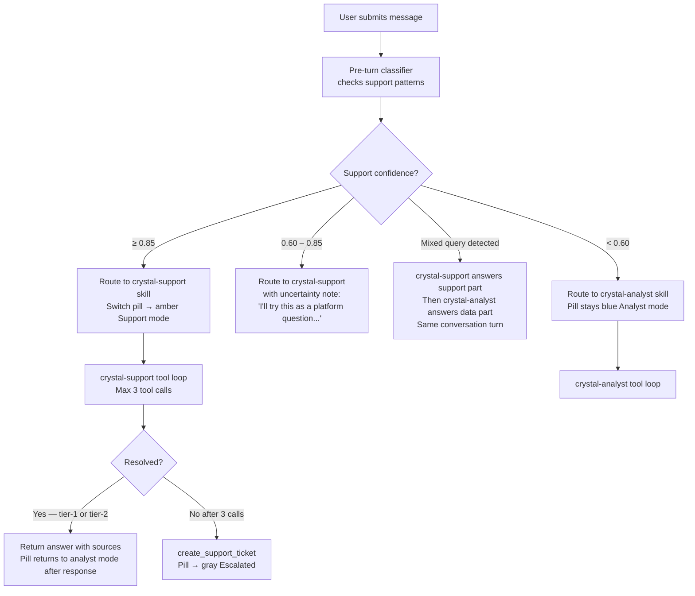
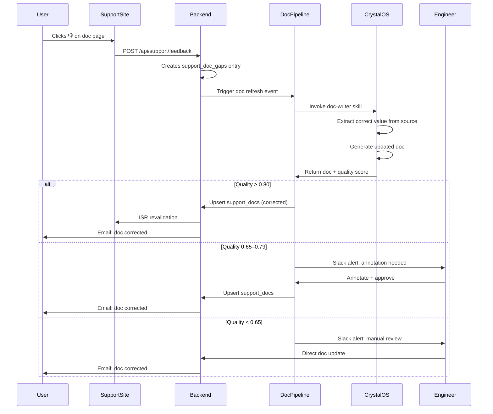

# Experient Support System — UX Flows
## Complete Interaction Design for Engineers and QA Teams

**Status:** Canonical UX Specification  
**Owner:** UX + Product  
**Audience:** Frontend engineers, QA, Crystal skill engineers  
**Companion to:** [DESIGN.md](./DESIGN.md), [CRYSTAL_SUPPORT.md](./CRYSTAL_SUPPORT.md), [SITE_STRUCTURE.md](./SITE_STRUCTURE.md)

---

## Quick Reference: Design System Tokens

| Token | Value | Usage |
|-------|-------|-------|
| Primary | `#2a4bd9` | Crystal analyst mode pill, primary CTAs |
| Tertiary | `#8329c8` | Accent, secondary actions |
| Secondary | `#00647c` | Status healthy indicators |
| Support pill (amber) | `#d97706` bg | Crystal support mode indicator |
| Analyst pill (blue) | `#2a4bd9` bg | Crystal analyst mode indicator |
| Escalated pill (gray) | `#6b7280` bg | Ticket created, human follow-up |
| Investigating pill (red) | `#dc2626` bg | Crystal calling tools (spinner) |
| Heading font | Manrope | All headings h1–h4 |
| Body font | Inter | All body text, UI labels |
| Animation ease | `cubic-bezier(0.22, 1, 0.36, 1)` | All panel transitions |
| Stagger delay | `0.06s` | List items, cards animating in |

---

## Interaction Timing Budget

These are hard targets. If a surface exceeds its budget, it is broken from a UX perspective.

| Interaction | Maximum Acceptable Time | P95 Target |
|-------------|------------------------|------------|
| Cmd+K open to input focused | 120ms | 80ms |
| Crystal first token visible | 2.5s | 1.5s |
| Crystal full answer (tier-1, simple) | 8s | 5s |
| Crystal full answer (tier-2, tool calls) | 15s | 10s |
| Crystal escalation ticket creation | 5s | 3s |
| Support site doc page load (FCP) | 1.5s | 1.2s |
| Support site search results appear | 400ms | 250ms |
| Status page refresh cycle | 3s | 2s |
| Roadmap page load | 1.0s | 800ms |
| Crystal mode switch pill animation | 300ms | 200ms |
| Feedback form expansion (thumbs down) | 200ms | 150ms |
| Escalation card render | 500ms | 300ms |
| Known issue card render | 400ms | 250ms |

---

## Mode Switching Logic

### Classification Architecture

Before every Crystal turn, a pre-turn intent classifier evaluates the query. This happens server-side in CrystalOS before any tool calls begin.



### Visual Transition Protocol

When Crystal switches mode mid-conversation:

1. **Fade out** current pill (200ms, `opacity: 1 → 0`, ease `[0.22, 1, 0.36, 1]`)
2. **Morph width** of pill to new label width (150ms, `width` transition)
3. **Background color** crossfade (150ms, blue → amber or vice versa)
4. **Fade in** new pill label (200ms, `opacity: 0 → 1`)
5. **Total duration:** 350ms end-to-end — perceptible but not jarring

**Mode pill positions:**
- Crystal panel (in-app): top-right of panel header, inline with "Crystal" wordmark
- Support site standalone: top-right of Crystal panel embed
- Mobile Crystal FAB expanded: below the Crystal name, full-width soft pill

**Never switch mode without a visible pill change.** The pill is the user's only affordance for understanding what Crystal is doing.

---

## Zero-State Designs

### Zero-State 1: Crystal Panel (First Time, No History)

New user, no prior Crystal sessions. Panel opens via Cmd+K or FAB.

```
┌─────────────────────────────────────────────────────┐
│ Crystal                          ○ Ready              │
├─────────────────────────────────────────────────────┤
│                                                     │
│  (Manrope, 16px, #374151)                           │
│  Hi — I'm Crystal. I know your data, your platform,  │
│  and what's coming. Ask me anything.                │
│                                                     │
│  Try asking:                                        │
│  · "Summarize this survey's NPS trend"              │
│  · "How do I export responses as CSV?"              │
│  · "Is SAML SSO available yet?"                     │
│                                                     │
│  ┌──────────────────────────────────────────────┐   │
│  │  Ask Crystal...                          [↑] │   │
│  └──────────────────────────────────────────────┘   │
│                                                     │
│  (footer, Inter 12px, #9ca3af)                      │
│  Crystal uses your survey data to answer. Your data │
│  stays in your org.                                 │
└─────────────────────────────────────────────────────┘
```

### Zero-State 2: Support Site Home (No Auth)

Unauthenticated visitor at `support.experient.ai`.

Crystal panel is visible but shows a softer prompt — no account-specific suggestions possible.

```
┌──────────────────────────────────────────────────────────────────────┐
│  Crystal                                              ○ Ready         │
│                                                                      │
│  Ask anything about Experient. I know what's live, what's in beta,   │
│  and what's coming.                                                  │
│                                                                      │
│  [ What can I help with?                                        [↑] ]│
│                                                                      │
│  Popular right now:                                                  │
│  · How do I export responses?    · Is SAML SSO available yet?        │
│  · What's the difference between NPS and CSAT?                      │
└──────────────────────────────────────────────────────────────────────┘
```

"Popular right now" is populated from the last 7 days' most-asked Crystal queries, anonymized. If < 3 queries in the window, falls back to editorial defaults.

### Zero-State 3: Support Site Home (Authenticated)

Clerk session present. Crystal knows org and plan.

```
┌──────────────────────────────────────────────────────────────────────┐
│  Crystal                                              ○ Ready         │
│                                                                      │
│  Hey — I can see your org's account and active surveys. What's up?  │
│                                                                      │
│  [ What can I help with?                                        [↑] ]│
│                                                                      │
│  Based on your plan (Business):                                      │
│  · Your rate limits     · How to invite team members                 │
│  · Your credit usage this period                                     │
└──────────────────────────────────────────────────────────────────────┘
```

### Zero-State 4: Doc Page Feedback Section (Never Submitted)

```
┌────────────────────────────────┐
│ Was this page helpful?         │
│  👍 Yes    👎 No               │
└────────────────────────────────┘
```

After 👎, the section expands (height animation, 200ms ease `[0.22, 1, 0.36, 1]`):

```
┌──────────────────────────────────────────────────────┐
│ Was this page helpful?   👍 Yes    👎 No              │
│                                                      │
│ What was missing or incorrect?                       │
│ ┌──────────────────────────────────────────────────┐ │
│ │                                                  │ │
│ └──────────────────────────────────────────────────┘ │
│  [Submit feedback]                                   │
└──────────────────────────────────────────────────────┘
```

### Zero-State 5: Roadmap Page (No Shipped Items)

Fallback if the system has never parsed any shipped features (e.g., fresh install, bootstrap not yet run):

```
┌──────────────────────────────────────────────────────┐
│  Just Shipped                                        │
│                                                      │
│  The changelog is being generated. Check back soon. │
│  Last attempted: [timestamp]                         │
└──────────────────────────────────────────────────────┘
```

### Zero-State 6: Escalation View (No Prior Tickets)

When a user opens their ticket history for the first time:

```
┌──────────────────────────────────────────────────────┐
│  Your Support Tickets                                │
│                                                      │
│  No tickets yet. Crystal handles most questions      │
│  automatically — if it can't, it creates a ticket    │
│  here with full context for our team.                │
└──────────────────────────────────────────────────────┘
```

---

## Journey 1: The Frustrated API Developer

**Persona:** Alex Kim, backend engineer integrating Experient's API into their company's survey pipeline. Mid-session, something breaks without an obvious cause.

**Goal:** Diagnose and resolve a 401 error on `POST /api/surveys` without leaving their development environment or opening a second tab.

### Entry Point

Alex is in their IDE. The terminal shows:
```
POST https://api.experient.ai/api/surveys → 401 Unauthorized
```
They have the Experient app open in a browser tab from earlier.

### Step-by-Step Flow

**Step 1 — Copy error, switch to Experient app (0s)**

Alex copies the error text from their terminal and switches to the Experient app browser tab. They are on the Surveys list page.

**Step 2 — Open Cmd+K (0s → 120ms)**

Alex presses `Cmd+K` (macOS) or `Ctrl+K` (Windows/Linux).

*System:*
- The Crystal panel opens as a centered modal overlay over the current page
- Animation: panel slides up from bottom 40px with `opacity: 0 → 1`, ease `[0.22, 1, 0.36, 1]`, duration 200ms
- Input field receives focus automatically
- Placeholder text: "Ask Crystal..."
- Timing: input focused within 120ms of keypress

**Step 3 — Type query (0.5s → 3s)**

Alex types: `401 API surveys POST`

*System:*
- No autocomplete or pre-suggestions fire during typing (no distraction)
- Query is held client-side until submission

**Step 4 — Submit and watch Crystal classify (3s → 3.5s)**

Alex presses Enter.

*System:*
- Query sent to `POST /agents/crystal-support` with context:
  ```json
  {
    "query": "401 API surveys POST",
    "org_id": "alex-org-id",
    "user_id": "alex-user-id",
    "intent_category": "api",
    "context": {
      "current_page": "/surveys",
      "account_state": { "plan": "business", ... }
    }
  }
  ```
- Pre-turn classifier fires: pattern `\b401\b.*\bapi\b` matches → category `api`, confidence 0.92
- Crystal routes to `crystal-support` skill
- Panel pill changes from white/gray "Ready" to amber "Support mode — investigating..."
- Spinner appears next to pill
- First streaming token appears within 2.5s

**Step 5 — Crystal streams response (~3.5s → 8s)**

The panel streams Crystal's response. Streaming works token by token — users see text appearing like a cursor is typing it.

First, Crystal outputs its opening line:

> "I'm checking the API docs and known issues for 401 errors on POST /api/surveys..."

This is rendered immediately as the first token. Below the text, a loading indicator shows the tool waterfall in progress.

**Crystal's tool call waterfall:**

```
Tool call 1 (0s → 1.2s): search_support_docs
  query: "401 unauthorized POST /api/surveys authentication"
  category_filter: "api"
  → Returns: api.surveys.create doc (score: 0.94) with auth section
  → Returns: api.overview doc (score: 0.87) with API key format

Tool call 2 (1.2s → 2.1s): get_known_issues
  topic: "401 API authentication"
  → Returns: issue KI-0041 "Auth middleware regression"
    title: "POST endpoints returning 401 after Sprint 7C deploy"
    status: "mitigated"
    severity: "high"
    workaround: "Re-generate your API key from Settings > API Keys"
    eta_text: "Full fix: Sprint 8 hotfix (this week)"
```

Crystal found the resolution after 2 tool calls. It does not call a third.

**Step 6 — Crystal's full answer renders (8s)**

```
┌─────────────────────────────────────────────────────┐
│ Crystal                          ○ Support mode       │
├─────────────────────────────────────────────────────┤
│                                                     │
│  You: 401 API surveys POST                          │
│                                                     │
│  Crystal: Found it. There's an active known issue   │
│  with auth middleware that affects all POST          │
│  endpoints. It was introduced in last week's         │
│  deploy.                                            │
│                                                     │
│  ┌─────────────────────────────────────────────┐   │
│  │ ⚠️ Known Issue KI-0041 · High · Mitigated   │   │
│  │ Auth middleware returning 401 on POST        │   │
│  │ endpoints after Sprint 7C deploy.            │   │
│  │                                             │   │
│  │ Workaround: Re-generate your API key from   │   │
│  │ Settings > API Keys. This issues a new key  │   │
│  │ that bypasses the affected code path.        │   │
│  │                                             │   │
│  │ Fix ETA: Sprint 8 hotfix (this week)         │   │
│  │                        [Full details ↗]     │   │
│  └─────────────────────────────────────────────┘   │
│                                                     │
│  [Go to API Keys settings →]                        │
│                                                     │
│  Was this helpful?   👍   👎 — open ticket          │
└─────────────────────────────────────────────────────┘
```

The "Go to API Keys settings" button is a deep-link: clicking it closes the Crystal panel, navigates to `/settings/api-keys`, and opens the key rotation UI directly.

**Step 7 — Alex applies the workaround (10s → 90s)**

Alex clicks "Go to API Keys settings". Crystal panel closes (fade out, 150ms). The settings page opens. Alex clicks "Rotate key", copies the new key, pastes it into their IDE, reruns their test call.

```
POST https://api.experient.ai/api/surveys → 201 Created
```

**Step 8 — Success state**

Alex resolved the issue in under 2 minutes without a ticket, without leaving the app, and without finding the issue through manual doc browsing.

### Emotional Arc

`Frustrated (401 with no context) → Focused (typing query) → Cautious (watching Crystal work) → Relieved (known issue found) → Confident (workaround is clear) → Satisfied (POST returns 201)`

### Success State

API call returns 201. User never left the Experient app. No ticket created.

### Failure State

If `get_known_issues` returns no matches and `search_support_docs` finds only generic auth docs:

- Crystal outputs: "I found the auth documentation but no known issues matching your exact 401. It's possible this is org-specific — let me check your account state."
- Crystal calls `get_account_state` as the third tool call
- If account state is normal (key active, plan valid), Crystal escalates:
  > "I've checked the docs, known issues, and your account. Nothing explains this definitively. I've opened a ticket with full context."
- Escalation card renders (see Journey 6 for card design)

### Key Design Decisions This Journey Informed

1. **Cmd+K must open to focused input in < 120ms** — a developer's muscle memory. Any visible latency breaks the flow.
2. **Known issue cards use high-information density** — severity, status, workaround, and ETA all visible without expanding.
3. **Deep-link CTA buttons** ("Go to API Keys settings") eliminate the "now where do I go?" moment after Crystal gives an answer.
4. **Crystal shows tool reasoning in plain English** ("I'm checking the API docs and known issues...") so users feel informed, not waiting in the dark.

---

## Journey 2: The New Enterprise Admin Onboarding

**Persona:** Priya Singh, IT admin at a 2,000-employee financial services firm. Onboarding Experient for their CX team. Has a Monday deadline from her CTO to have SSO configured.

**Goal:** Configure SAML SSO for the organization.

### Entry Point

Priya is in `BrandSettingsPage` > SSO section. She sees a placeholder card with a lock icon and "SSO" label. She clicks "Learn how to configure SSO."

### Step-by-Step Flow

**Step 1 — Click SSO learn link (0s)**

*System:*
- Opens `support.experient.ai/features/saml-sso` in a new tab
- Deep-link carries UTM-style context: `?ref=app.settings.sso`

**Step 2 — Page loads (0s → 1.2s)**

The SAML SSO feature page renders.

```
┌──────────────────────────────────────────────────────────────────────┐
│  Support / Features / SAML SSO                                       │
│                                                                      │
│  SAML SSO                          ⬜ PLANNED · Sprint 10            │
│                                                                      │
│  Enterprise single sign-on via SAML 2.0. Enables your organization  │
│  to use your existing IdP (Okta, Azure AD, Google Workspace, ADFS)   │
│  to authenticate all Experient users.                                │
└──────────────────────────────────────────────────────────────────────┘
```

The `⬜ PLANNED · Sprint 10` badge is rendered in **amber text** (`#d97706`) with a dashed border — visually distinct from the green `✅ Stable` badge on live features. The badge color and icon are the primary signal.

**Step 3 — Discovery moment: it's not live (1.5s)**

Priya reads the PLANNED badge. Below the header, a callout block is visible immediately (not collapsed):

```
┌──────────────────────────────────────────────────────┐
│ ⚠️  SAML SSO is not yet available                    │
│                                                      │
│  This feature is planned for Sprint 10 (Q3 2026).   │
│  Estimated release: September 2026.                  │
│                                                      │
│  What you can use today:                             │
│  · Google / Microsoft social login (Clerk)           │
│  · Email + password with MFA                         │
│  · Enterprise early access — talk to sales           │
│                                                      │
│  [Notify me when SAML ships →]  [Talk to sales →]   │
└──────────────────────────────────────────────────────┘
```

This callout block is auto-generated by the Content Engine based on the `planned` status tag from TRACKER.md item `10-1`. It is not hand-authored.

**Step 4 — Priya reads the alternatives (2s → 30s)**

The "What you can use today" section is link-dense. She reads. Realizes Google social login won't satisfy her IT department's compliance requirements.

**Step 5 — Priya opens Crystal for ETA (30s)**

She clicks the "Ask Crystal about this page" expand button at the bottom of the page content area. The Crystal panel opens inline, pre-loaded with page context:

```
┌──────────────────────────────────────────────────────┐
│ Crystal                       ○ Support mode           │
├──────────────────────────────────────────────────────┤
│                                                      │
│  You're on the SAML SSO page. Ask me anything about  │
│  it or about alternatives.                          │
│                                                      │
│  [ Ask Crystal about SAML SSO...              [↑] ] │
└──────────────────────────────────────────────────────┘
```

Priya types: `when is SAML shipping exactly and can my org get early access`

**Step 6 — Crystal responds (2.5s → 7s)**

**Crystal's tool call waterfall:**

```
Tool call 1 (0s → 0.9s): get_feature_status
  feature_name: "SAML SSO"
  → { status: "planned", sprint: 10, eta_text: "Q3 2026",
      doc_url: "/features/saml-sso",
      detail: "Sprint 10 start: estimated August 2026" }

Tool call 2 (0.9s → 1.8s): get_account_state
  org_id: "priya-org-id"
  → { plan: "enterprise", active_features: [...],
      stripe_status: "active" }
```

Crystal's response:

> "SAML SSO is planned for Sprint 10, which starts in August 2026 — target release Q3 2026.
>
> Your org is on the Enterprise plan, which means you qualify for early access. I'd recommend contacting the sales team directly — they can flag your org for the beta cohort. The link below goes directly to that request.
>
> In the meantime, Clerk's social login supports Google Workspace and Microsoft 365 — if your team uses either of those, you can configure organization-level login without SAML today.
>
> [→ Request Enterprise early access]
> [→ Configure social login now]
> [→ Notify me when SAML ships]"

The "Notify me when SAML ships" CTA calls `POST /api/support/notifications/subscribe` with `{ feature_tag: "saml-sso", user_email: priya@firm.com }`. When Sprint 10's SAML item moves to `✅ Shipped` in TRACKER.md, a Novu event `feature.shipped` fires and Priya receives an email.

**Step 7 — Priya subscribes to notification (7s → 15s)**

Priya clicks "Notify me when SAML ships." The button shows a checkmark and "You'll be notified at priya@firm.com" confirmation text. She closes the Crystal panel.

**Step 8 — Priya returns to the app (15s → 20s)**

She navigates back to BrandSettingsPage. The SSO card now shows a small amber badge: "Planned · Notify set ✓" — reflecting her subscription state persisted to her account.

### Emotional Arc

`Goal-oriented (I have a Monday deadline) → Surprised (oh, it's not live) → Searching (what can I do today?) → Informed (Crystal explains alternatives + ETA) → Calm (I subscribed, I'm on early access list, I have a workaround)`

### Success State

Priya has a clear picture: feature ETA, a practical workaround, an escalation path to sales, and a notification subscription. She can answer her CTO with accurate information.

### Failure State

If `get_feature_status` returns `not_found` (e.g., the doc hasn't been regenerated yet after a TRACKER.md update):

- Crystal responds: "I can see you're on the SAML SSO page. The feature tracker doesn't have a current entry — this might mean the status just changed. Based on what I last indexed, SAML was planned for Q3 2026."
- Crystal adds: "For the most accurate ETA, the What's Coming page refreshes automatically. [View current roadmap →]"
- The answer is honest about the uncertainty, not made up.

### Key Design Decisions This Journey Informed

1. **The PLANNED badge must be visually distinct and above the fold** — amber, dashed border, visible immediately without scrolling. Discovering it 500px down the page after reading setup instructions would be a failure.
2. **The callout block is auto-generated, not hand-authored** — this is what makes it reliable. Human authors forget to update it when ETAs shift; the Content Engine regenerates it on every TRACKER.md push.
3. **Crystal checks account state when a feature question is asked by an enterprise user** — plan-aware responses are significantly more useful than generic ones.
4. **Subscription CTAs use in-place confirmation** — no modal, no page reload. The button morphs to a confirmation state.

---

## Journey 3: The CX Analyst Stuck on Exports

**Persona:** Maria Chen, CX analyst at a retail company. She needs to share monthly NPS data with her VP by 5pm. The export button isn't working.

**Goal:** Get her CSV export and make her 5pm deadline.

### Entry Point

Survey responses page. Maria clicks the "Export CSV" button. A spinner appears. After 20 minutes, the spinner is still running. She's refreshed the page. The spinner returns. Nothing downloaded.

### Step-by-Step Flow

**Step 1 — Open Crystal panel via FAB (0s)**

Maria clicks the Crystal floating action button (bottom-right of the responses page). The Crystal panel slides up from the bottom-right corner (mobile-style FAB on desktop too).

*System:*
- Crystal's context includes `current_page: "/surveys/[survey-id]/responses"` and `active_survey_id: "[survey-id]"`
- Crystal sees she's on the responses page — relevant to support classification

**Step 2 — Maria types her query (2s → 5s)**

Maria types: `my CSV export has been spinning for 20 minutes nothing downloaded`

**Step 3 — Crystal classifies and responds (5s → 7.5s)**

Pre-turn classifier: pattern `\bcsv\b.*\bexport\b` + `spinning|fail` → category `data-export`, confidence 0.88. Routes to `crystal-support`.

Crystal's streaming opening:

> "I'm checking known issues for CSV export problems..."

The amber "Support mode — investigating..." pill appears.

**Crystal's tool call waterfall:**

```
Tool call 1 (0s → 1.1s): get_known_issues
  topic: "CSV export timeout"
  → Returns: KI-0037 "CSV Export Timeout on Large Surveys"
    title: "CSV exports timeout on surveys with > 50K responses"
    status: "open"
    severity: "medium"
    workaround: "Use filtered export: select a date range under 6 months
                 to reduce row count below the 50K limit"
    eta_text: "Expected fix: Sprint 9"

Tool call 2 (1.1s → 2.0s): get_account_state
  org_id: "maria-org-id"
  → response_count_active_survey: 62841
```

Crystal has what it needs. Resolution tier: 2. No third tool call.

**Step 4 — Crystal renders the known issue card (7.5s)**

```
┌─────────────────────────────────────────────────────┐
│ Crystal                          ○ Support mode       │
├─────────────────────────────────────────────────────┤
│                                                     │
│  You: my CSV export has been spinning for 20 mins   │
│                                                     │
│  Crystal: Found the issue. Your survey has 62,841   │
│  responses — that's above the current 50K export    │
│  limit, which causes the timeout you're seeing.     │
│                                                     │
│  ┌─────────────────────────────────────────────┐   │
│  │ 📄 Known Issue KI-0037 · Medium · Open      │   │
│  │ CSV exports timeout on surveys >50K rows     │   │
│  │                                             │   │
│  │ Workaround: Use filtered export             │   │
│  │ Select a 6-month date range. This brings     │   │
│  │ the row count under the limit.              │   │
│  │                                             │   │
│  │ Fix ETA: Sprint 9 (next sprint)             │   │
│  │                       [Full details ↗]     │   │
│  └─────────────────────────────────────────────┘   │
│                                                     │
│  [Try filtered export now →]                        │
│                                                     │
│  Was this helpful?   👍   👎 — open ticket          │
└─────────────────────────────────────────────────────┘
```

The "Try filtered export now" deep-link opens the export modal with the date range filter pre-selected and a helper tooltip pointing at it.

**Step 5 — Maria uses the workaround (10s → 60s)**

Maria clicks the deep-link. The export modal opens with "Filter by date range" already expanded. She sets: last 6 months. Clicks export. Download begins immediately.

```
✅ export_nps_last6mo.csv — 2.3MB downloaded
```

**Step 6 — Maria gives thumbs up (60s → 65s)**

She taps 👍. The feedback is stored in `support_tickets.feedback_score = 5`. Because it's a positive resolution, Crystal's response is written to `skill_examples` for future training.

### Emotional Arc

`Panicking (deadline in 4 hours, export broken) → Skeptical (will Crystal know?) → Relieved (known issue card appears) → Practical (workaround is clear) → In control (download started) → Grateful (made the deadline)`

### Success State

CSV downloaded. Resolution in under 90 seconds from opening the Crystal panel. No ticket required. Maria made her 5pm.

### Failure State

If `get_known_issues` returns no match for CSV export (e.g., this is a novel issue, not yet documented):

- Crystal calls `get_system_status` as the second tool call: `Exports: healthy`
- Crystal calls `get_account_state` as the third tool call to check if there's an account-level flag
- If no resolution found after 3 calls, Crystal creates a ticket (see Journey 6) and informs Maria: "This doesn't match any known issue. I've opened a ticket — our team will investigate and reply to you."

### Key Design Decisions This Journey Informed

1. **Crystal uses account data (response count) to make the answer specific** — "your survey has 62,841 responses" is more useful than "surveys over 50K responses." Crystal must pull account context, not just return a generic known issue.
2. **Deep-link CTAs bypass the "now what?" moment** — opening the export modal pre-filtered removes decision cost.
3. **Known issue cards show workaround directly** — not a link to find the workaround. The workaround text is visible in the card itself.

---

## Journey 4: The Enterprise Customer Who Doesn't Trust AI

**Persona:** Jordan Webb, VP CX at a financial services firm (3,500 employees). Skeptical of AI-generated answers. Prefers primary sources. Has had bad experiences with hallucinated documentation.

**Goal:** Understand the exact parameters and validation rules for `POST /api/surveys/create` before integrating it.

### Entry Point

Jordan navigates directly to `support.experient.ai/api/surveys/create` — she found the URL in the API Overview page.

### Step-by-Step Flow

**Step 1 — Page loads (0s → 1.2s)**

Jordan lands on the Create Survey API doc page.

```
┌──────────────────────────────────────────────────────────────────────┐
│  Support / API / Surveys / Create Survey                             │
│                                                                      │
│  Create Survey                                    ✅ Stable          │
│  POST /api/surveys                                                   │
│                                                                      │
│  Creates a new survey in your organization. Requires analyst role    │
│  or higher. Survey creation costs 0 credits; AI question generation  │
│  costs 10 credits per generation.                                    │
│                                                                      │
│  This page was generated from backend/src/routes/experience.ts       │
│  on June 25, 2026 at 14:32 UTC.  [View source ↗]                    │
└──────────────────────────────────────────────────────────────────────┘
```

The "generated from source" footer at the top and the "View source" link to the raw route file are trust signals for skeptical users. Jordan sees the exact timestamp and source file.

**Step 2 — Jordan reads the Parameters tab (2s → 3 minutes)**

Jordan clicks to the Parameters tab. She reads the complete field table:

```
┌────────────────────────────────────────────────────────────────────┐
│  Parameters                                                        │
├────────────┬────────┬──────────┬─────────────────────────────────┤
│  Field     │ Type   │ Required │ Description                     │
├────────────┼────────┼──────────┼─────────────────────────────────┤
│  title     │ string │ Yes      │ Survey name. 3–200 chars.       │
│  type      │ enum   │ Yes      │ 'nps' | 'csat' | 'ces' |       │
│            │        │          │ 'custom'                        │
│  questions │ array  │ No       │ Pre-load questions. Max 50.     │
│  brand_id  │ UUID   │ No       │ Associate with brand profile.   │
│  tags      │ array  │ No       │ String tags for filtering.      │
│  status    │ enum   │ No       │ 'draft' (default) | 'active'   │
└────────────┴────────┴──────────┴─────────────────────────────────┘
```

**Step 3 — Jordan copies curl example (3 min → 5 min)**

She clicks the "Code" tab, then the "curl" sub-tab. Copies the example:

```bash
curl -X POST https://api.experient.ai/api/surveys \
  -H "Authorization: Bearer YOUR_API_KEY" \
  -H "Content-Type: application/json" \
  -d '{
    "title": "Q3 NPS Survey",
    "type": "nps"
  }'
```

She pastes it into her terminal, substitutes her API key, runs it.

**Step 4 — Jordan gets a 422 error (5 min)**

```json
{
  "error": "Validation failed",
  "code": 422,
  "details": [
    {
      "field": "title",
      "message": "Survey title must not match an existing active survey title"
    }
  ]
}
```

**Step 5 — Jordan searches for "422 surveys" (5 min → 5.5 min)**

Jordan opens the search bar at the top of the support site. Types: `422 surveys`. Search results appear in 280ms:

```
Search results for "422 surveys":
1. Create Survey — Errors section: 422 Validation Failed ✅ Stable
2. API Error Reference — 422 codes reference ✅ Stable
3. Survey Data Model — Unique title constraint ✅ Stable
```

She clicks result 1, which deep-links directly to the "Errors" tab of the Create Survey page, with the 422 entry highlighted.

**Step 6 — Jordan reads the errors section (5.5 min → 7 min)**

The Errors tab shows:

```
┌────────────────────────────────────────────────────────────────────┐
│  Error Codes                                                       │
├────────┬─────────────────────────────────────────────────────────┤
│  Code  │ Meaning + Fix                                           │
├────────┼─────────────────────────────────────────────────────────┤
│  422   │ Validation failed. The response body includes a         │
│        │ details array listing each invalid field and why.       │
│        │                                                         │
│        │ Common causes:                                          │
│        │ · title: must be unique within active surveys in your  │
│        │   org. Soft-deleted surveys don't count.               │
│        │ · type: must be one of the enum values exactly.        │
│        │ · questions.length > 50: not allowed.                  │
└────────┴─────────────────────────────────────────────────────────┘
```

Jordan sees the unique title constraint. Her test title "Q3 NPS Survey" already exists in her org from a previous test. She changes the title to "Q3 NPS Survey — June 2026" and retries.

**Step 7 — Crystal offers help; Jordan accepts (7 min → 7.5 min)**

After Jordan's search (step 5), the Crystal panel's "Ask Crystal about this page" expand button shows a soft pulse animation — a subtle affordance that Crystal noticed she searched. It is not an interruption; it does not open automatically.

Jordan, having now read the docs and found the answer herself, is curious. She clicks the expand button.

Crystal's opening (context-aware, because it sees she just did a search on this page):

> "You searched for '422 surveys' — did you get the validation error? I can explain the unique title constraint or check if there's something specific to your org."

Jordan types: "yes I got a unique title error — does my org have active surveys I might be conflicting with?"

**Step 8 — Crystal finds the answer; cites the doc (7.5 min → 10 min)**

**Crystal's tool call waterfall:**

```
Tool call 1 (0s → 1.0s): get_account_state
  org_id: "jordan-org-id"
  → { active_survey_count: 7,
      survey_titles: ["Q3 NPS Survey", "Employee Pulse 2026", ...] }
```

Crystal's response:

> "Your org has 7 active surveys. One is named 'Q3 NPS Survey' — that's the conflict.
>
> The validation rule (documented in the Errors tab above) is: survey titles must be unique within your org's active surveys. Archived surveys don't count.
>
> Fix: change your title to something unique — 'Q3 NPS Survey v2' or include a date like 'Q3 NPS Survey — June 2026'. Your call on naming.
>
> [See: Survey title uniqueness constraint →] ← links to the exact doc section"

Note: Crystal cites the doc and links to it. It does not describe a rule without sourcing it.

### Emotional Arc

`Skeptical (AI can't be trusted) → Methodical (reads docs primary) → Puzzled (422 error with no clear cause) → Investigating (searches support site) → Finding (422 errors section) → Impressed (Crystal cited the doc, didn't invent it) → Trust established`

### Success State

Jordan created her survey. She now trusts the support system because Crystal pointed to documentation rather than replacing it. The session is a trust-building moment.

### Failure State

If Crystal invented a rule that doesn't exist in the docs, Jordan would flag it immediately. The anti-hallucination evaluation in `crystal-eval` prevents this: every Crystal answer must cite a source doc. Answers without sources score below the passing threshold and are blocked.

### Key Design Decisions This Journey Informed

1. **"Generated from source" with timestamp and link to source file** — the single most effective trust signal for skeptical enterprise users.
2. **Crystal cites sources in every response** — links back to the exact doc section that supports each claim. This is enforced at the skill evaluation level, not just a guideline.
3. **Crystal offering help after a search** (subtle pulse animation) is opt-in, not auto-open. Interrupting a focused user destroys trust faster than any other UX mistake.
4. **The 422 errors section must be on the doc page** — not only in a separate "Error Reference." Auto-generated per-endpoint docs include the common error codes for that endpoint specifically.

---

## Journey 5: The Product Manager Checking the Roadmap

**Persona:** David Park, PM at Experient's customer organization. Presenting to his leadership team Thursday. Needs to know if the workflow visual builder ships before his Q3 planning window closes.

**Goal:** Get an accurate ship date for the workflow visual builder, then subscribe to updates.

### Entry Point

David is inside the Experient app, on the Workflows list page.

### Step-by-Step Flow

**Step 1 — Open Cmd+K (0s → 120ms)**

David presses `Cmd+K`.

**Step 2 — Type roadmap query (2s)**

Types: `workflow builder shipping date`

**Step 3 — Crystal classifies as feature-status (2s → 2.5s)**

Pre-turn classifier: `\bworkflow\b.*\bbuilder\b` + `\bshipping|shipping date|when\b` → category `feature-status`, confidence 0.87.

Crystal routes to `crystal-support`, amber pill activates.

**Crystal's tool call waterfall:**

```
Tool call 1 (0s → 0.8s): get_feature_status
  feature_name: "workflow visual builder"
  → { status: "building",
      detail: "Sprint 9, Q3 2026. In Progress 40%",
      eta_text: "Target: Sprint 9 completion (August 2026)",
      doc_url: "/features/workflows",
      sprint: 9 }
```

Single tool call. Crystal has the answer.

**Step 4 — Crystal renders roadmap card (2.5s → 5s)**

```
┌─────────────────────────────────────────────────────┐
│ Crystal                          ○ Support mode       │
├─────────────────────────────────────────────────────┤
│                                                     │
│  You: workflow builder shipping date                │
│                                                     │
│  Crystal: The workflow visual builder is in Sprint  │
│  9, currently 40% complete.                         │
│                                                     │
│  ┌─────────────────────────────────────────────┐   │
│  │ 🔄 Workflow Visual Builder · Sprint 9        │   │
│  │ In Progress · Q3 2026                        │   │
│  │                                             │   │
│  │ ████████░░░░░░░░  40% complete              │   │
│  │                                             │   │
│  │ Target: August 2026                         │   │
│  │ [See full roadmap ↗]  [Notify me ↗]        │   │
│  └─────────────────────────────────────────────┘   │
│                                                     │
│  Was this helpful?   👍   👎 — open ticket          │
└─────────────────────────────────────────────────────┘
```

**Step 5 — David clicks "See full roadmap" (5s)**

The Cmd+K panel closes (fade out, 150ms). Navigation to `support.experient.ai/roadmap` — opens in a new tab (external URL), or if the roadmap is embedded in-app, navigates to `/roadmap`.

**Step 6 — Roadmap page loads (5s → 6.2s)**

David lands on the "What's Coming" page with the filter preset to "Building Now" and the workflow builder card highlighted (deep-link behavior from the Crystal card's `[See full roadmap ↗]` button).

**Step 7 — David subscribes to workflow builder updates (8s → 20s)**

David scrolls to the workflow visual builder card. He clicks the "Notify me when this ships" button on the card.

*System:*
- A micro-modal appears (200ms slide up): "Get notified when workflow visual builder ships"
- Email field pre-populated from Clerk session: `david@company.com`
- Single "Subscribe" button
- On submit: `POST /api/support/notifications/subscribe { feature_tag: "workflow-visual-builder", user_email }`
- Button morphs to "✓ You're subscribed" (green checkmark, Inter 14px)
- Modal dismisses after 1.5s automatically

### Emotional Arc

`Purposeful (need an answer for Thursday) → Focused (types exact query) → Satisfied (card shows exactly what he needs) → Thorough (clicks to see full roadmap) → Covered (subscribed to updates)`

### Success State

David has a specific target date (August 2026), a progress indicator (40%), and a notification subscription. His Thursday presentation has accurate data.

### Failure State

If `get_feature_status` returns `not_found` for "workflow visual builder":

- Crystal tries `search_support_docs` as a second call: `query: "workflow builder"`
- If still no result, Crystal responds: "I don't have a current status entry for the workflow visual builder. The roadmap page is updated on every deploy — it may have more current information than my index."
- Crystal links directly to the roadmap page: `[Check What's Coming →]`
- Honest uncertainty + a direct path forward.

### Key Design Decisions This Journey Informed

1. **Progress percentage in the Crystal card** — 40% is a useful signal. It tells a PM whether "in progress" means started-yesterday or almost-done.
2. **Deep-link from Crystal card to roadmap with pre-scrolled highlight** — the roadmap page should receive the feature ID as a URL hash and highlight/expand that card on load.
3. **Notification subscription happens inside the roadmap, not just in Crystal** — users who browse directly to the roadmap should also be able to subscribe.

---

## Journey 6: The Escalation Path (Crystal Can't Help)

**Persona:** Raj Mehta, lead engineer at an enterprise customer. His Stripe webhook for payment events stopped firing two days ago. He has checked everything he can check from his side.

**Goal:** Get a human engineer to diagnose and fix the webhook issue.

### Entry Point

Crystal panel in the Experient app.

### Step-by-Step Flow

**Step 1 — Raj opens Crystal panel and types query (0s → 5s)**

Raj opens the Crystal panel via the FAB. Types:

`my Stripe webhook isn't firing and I've checked everything — API key is right, endpoint is reachable, no firewall blocks`

**Step 2 — Crystal classifies as integration broken (5s → 5.5s)**

Pre-turn classifier: pattern `\bstripe\b.*\bwebhook\b.*\bnot firing\b` → category `integration`, confidence 0.91. Routes to `crystal-support`.

**Crystal's tool call waterfall (all 3 calls, no resolution):**

```
Tool call 1 (0s → 1.3s): search_support_docs
  query: "Stripe webhook not firing integration"
  category_filter: "integration"
  → Returns: webhooks guide (score: 0.71, generic setup doc)
             Nothing specific to "webhook stopped firing" scenario

Tool call 2 (1.3s → 2.2s): get_known_issues
  topic: "Stripe webhook"
  → Returns: [] — no active known issues for Stripe webhooks

Tool call 3 (2.2s → 3.1s): get_system_status
  → { overall: "healthy",
      components: [
        { name: "API", status: "healthy" },
        { name: "Notifications", status: "healthy" },
        { name: "Billing", status: "healthy" }
      ],
      active_incidents: [] }
```

All three tool calls returned. No resolution. Crystal has now exhausted its budget.

Crystal calls `create_support_ticket`:

```
Tool call 4 — create_support_ticket:
  org_id: "raj-org-id"
  user_id: "raj-user-id"
  query: "Stripe webhook not firing..."
  category: "integration"
  crystal_summary: "Searched docs (webhooks guide found, no specific match).
                   No active known issues for Stripe. Platform status healthy.
                   Issue appears org-specific or backend configuration."
  tools_called: ["search_support_docs", "get_known_issues", "get_system_status"]
  recommended_action: "Check Stripe webhook delivery log in their dashboard.
                       Check backend webhook handler logs for received-but-unprocessed events.
                       Verify Stripe signing secret matches backend config."
  severity: "high"
→ Returns: { ticket_id: "EXP-3041", expected_response_time: "< 2 hours (Enterprise plan)" }
```

**Step 3 — Crystal renders the escalation card (8s → 9s)**

```
┌─────────────────────────────────────────────────────┐
│ Crystal                          ○ Escalated          │
├─────────────────────────────────────────────────────┤
│                                                     │
│  You: my Stripe webhook isn't firing...             │
│                                                     │
│  Crystal: I've investigated this and can't resolve  │
│  it from here. Here's what I checked and what       │
│  I've passed to our team.                           │
│                                                     │
│  ┌─────────────────────────────────────────────┐   │
│  │ 🎫 Ticket EXP-3041 · High · Open            │   │
│  │ Stripe webhook not firing (org-specific)    │   │
│  │                                             │   │
│  │ What Crystal checked:                       │   │
│  │ ✓ Docs — webhooks guide (no match)         │   │
│  │ ✓ Known issues — none for Stripe            │   │
│  │ ✓ System status — all healthy              │   │
│  │                                             │   │
│  │ What the team will investigate:             │   │
│  │ · Stripe webhook delivery log              │   │
│  │ · Backend handler logs                     │   │
│  │ · Signing secret configuration             │   │
│  │                                             │   │
│  │ Expected response: < 2 hours               │   │
│  │ (Enterprise plan SLA)                      │   │
│  │                        [Track ticket ↗]    │   │
│  └─────────────────────────────────────────────┘   │
│                                                     │
│  You'll receive an email at raj@company.com         │
│  when the team responds.                           │
└─────────────────────────────────────────────────────┘
```

The pill changes from amber to gray: "Escalated." This is a final state — Crystal will not attempt further tool calls on this query.

**Step 4 — What the engineer sees**

When the on-call engineer opens the ticket in the internal support dashboard, they see:

```
──────────────────────────────────────────────────────
Crystal Support — Escalation Package
Ticket #EXP-3041  |  Priority: High  |  Category: Integration

Customer:        Raj Mehta, lead engineer
Organization:    [Enterprise org]
Plan:            Enterprise
Opened:          2026-06-25 09:47 UTC

Customer Query:
"My Stripe webhook isn't firing and I've checked everything —
API key is right, endpoint is reachable, no firewall blocks."

What Crystal Investigated:
1. searched docs for "Stripe webhook not firing" — found
   general webhooks guide, no specific match (score 0.71)
2. checked known issues for "Stripe webhook" — 0 active issues
3. checked system status — all components healthy

Crystal's Assessment:
Issue appears org-specific. Documentation and known issues
provide no resolution path. Platform infrastructure is healthy
— this is likely a configuration issue or a backend processing
bug specific to this org's webhook events.

Recommended Investigation:
[ ] Check Stripe dashboard > Webhooks > delivery log for 
    this endpoint — look for delivery attempts that failed
[ ] Check backend logs: grep for org_id + "webhook" since 
    the issue started (2 days ago)
[ ] Verify STRIPE_WEBHOOK_SECRET env var matches the key
    in Stripe dashboard for this endpoint
[ ] Check if there was a deploy or env rotation in the 
    last 2 days

Expected Resolution: < 2 hours (Enterprise SLA)
──────────────────────────────────────────────────────
```

The engineer does not start from a blank ticket. Crystal's investigation log eliminates the diagnostic triaging phase and the "reproduce the issue" back-and-forth.

**Step 5 — Engineer resolves, Raj gets notified (< 2 hours)**

The engineer finds a signing secret mismatch from a key rotation 48 hours ago. Updates the config. Resolves the ticket. The system sends Raj an email:

```
Subject: Ticket EXP-3041 resolved — Stripe webhook fixed

Hi Raj,

Your Stripe webhook issue (EXP-3041) has been resolved.

Root cause: The webhook signing secret was rotated in 
Stripe but the corresponding backend config wasn't updated.

The config has been corrected. Your webhooks should be 
firing again — please confirm and let us know if you 
see any further issues.

[Rate this resolution →]
[View ticket EXP-3041 →]
```

### Emotional Arc

`Frustrated (spent 2 days on this) → Tentative (Crystal probably won't know either) → Watching (Crystal actually checked 3 things) → Trusting (Crystal is being transparent about its limits) → Grounded (the ticket has context, the team has a starting point) → Resolved`

### Success State

Raj's webhook fires. The engineer spent < 15 minutes on it because Crystal pre-identified the likely causes. The total time from Raj opening Crystal to issue resolved: under 2 hours.

### Failure State

If `create_support_ticket` fails (network issue, DB down):

- Crystal shows: "I tried to create a ticket but the system isn't responding. Please email support@experient.ai with ticket context — I'll include everything I found below so you can paste it."
- Crystal renders the escalation package as copyable text.

### Key Design Decisions This Journey Informed

1. **Crystal showing what it checked** is the core UX innovation of the escalation card. It prevents the "did you try X?" back-and-forth between customer and engineer.
2. **Transparent three-call limit** — users should understand Crystal tried 3 times, not that it gave up at the first difficulty. The checklist of "What Crystal checked" communicates effort, not failure.
3. **Escalation pill is gray, not red** — gray communicates "complete, in human hands" not "error." Red would create alarm; gray communicates calm handoff.
4. **Recommended investigation bullets are specific** — not "check the integration" but "check Stripe dashboard > Webhooks > delivery log for this endpoint."

---

## Journey 7: The Documentation Feedback Loop

**Persona:** Sam Torres, API developer who noticed an error in Experient's rate limit documentation.

**Goal:** Correct an inaccurate rate limit number in the API docs before another developer is blocked by it.

### Entry Point

`support.experient.ai/api/overview` — the API authentication and rate limits page.

### Step-by-Step Flow

**Step 1 — Sam reads the incorrect value (0s → 30s)**

Sam is on the API Overview page. He reads: "Rate limit: 200 requests per minute." He knows from his own testing that the actual limit is 100/minute — he hit it yesterday.

**Step 2 — Sam clicks thumbs down (30s)**

Sam scrolls to the bottom of the page. Clicks 👎 on "Was this page helpful?"

*System:*
- The feedback section expands (height animation, 200ms)
- A textarea appears: "What was missing or incorrect?"

**Step 3 — Sam submits the correction (30s → 60s)**

Sam types in the textarea:

> "The rate limit shown is 200 req/min but the actual limit is 100 req/min — I hit it in production last night. Please update."

Clicks "Submit feedback."

*System:*
- `POST /api/support/feedback`
- Creates a `support_doc_gaps` entry:
  ```
  doc_key: "api.overview"
  query_text: "The rate limit shown is 200 req/min but the actual limit is 100 req/min..."
  gap_category: "unclear-doc"
  auto_created: true
  ```
- Also creates a `support_tickets` entry (tier: 1, category: doc-feedback)
- Page shows confirmation: "Thanks — our documentation team reviews every correction."

**Step 4 — Automated pipeline triggers (60s → 10 min)**

The `support_doc_gaps` entry triggers a pipeline event. Within 10 minutes:

1. The gap entry is routed to the doc regeneration queue
2. CrystalOS `doc-writer` skill is invoked on `backend/src/routes/ai.ts` (or wherever rate limits are defined)
3. Crystal extracts the actual rate limit value from the Zod schema or middleware config
4. Crystal generates an updated `api.overview` doc with the correct value
5. `crystal-eval` scores the new doc

**Step 5 — Quality evaluation (10 min → 15 min)**

If the eval score is ≥ 0.80: the corrected doc goes live automatically.

If the eval score is 0.65–0.79: the draft is flagged to the human annotation queue with Sam's correction as context.

If the eval score is < 0.65: the existing doc is preserved and a human annotator is assigned.

**Step 6 — Human annotation (if needed, < 2 hours)**

An annotator in `#doc-eng` Slack receives:

```
📄 Doc feedback correction queued: api.overview
Customer report: "Rate limit is 100/min not 200/min"
Crystal draft: [link to draft]
Action needed: Verify correct rate limit, approve or annotate.
```

The annotator adds one sentence confirming the correct value and approves. The doc goes live.

**Step 7 — Corrected doc live (15 min for auto / < 2 hours for annotated)**

The `api.overview` page now shows: "Rate limit: 100 requests per minute."

The page footer shows: "Updated June 25, 2026 at 10:15 UTC."

**Step 8 — Sam receives email confirmation (within 30 min)**

```
Subject: Documentation updated — API Rate Limits

Hi Sam,

Your documentation feedback was applied. The API Overview page now 
shows the correct rate limit: 100 requests per minute.

Thanks for helping keep the docs accurate.

[View updated page →]
```

The email is sent via Novu template `doc.corrected`. It is triggered when the `support_doc_gaps` entry moves to `status: "resolved"`.

### Feedback Loop Diagram



### Emotional Arc

`Mildly annoyed (doc is wrong, other devs will hit this) → Pragmatic (submits correction in 30s) → Trusting (got an email confirmation) → Advocacy (this system actually works)`

### Success State

Corrected doc is live within 30 minutes. Sam gets confirmation. No one else hits the incorrect rate limit.

### Failure State

If the automated correction produces an inaccurate value (e.g., the source code has an outdated constant):

- The crystal-eval quality check catches factual inconsistency
- Falls back to human annotation queue
- Engineer verifies the rate limit directly from the code and corrects both the constant and the doc
- Two-level correction: doc and source

### Key Design Decisions This Journey Informed

1. **Feedback form must be one click to open, minimal to fill** — any friction here and the correction never gets submitted.
2. **Automated correction confirmation email closes the loop for the user** — without confirmation, the user doesn't know if their feedback mattered. This builds trust and encourages future corrections.
3. **The quality eval threshold is the quality gate**, not human review. Human review is the fallback, not the default. This is what enables < 30 min correction time.

---

## Journey 8: Mobile User (iOS Safari, iPhone 15)

**Persona:** Alex Rivera, CX team lead at a retail brand. Receives Novu push notification about NPS drop while commuting.

**Goal:** Understand the NPS drop, then find guidance on interpreting it.

### Entry Point

Push notification: "NPS dropped 8 points — Crystal has new insights."

### Step-by-Step Flow

**Step 1 — Tap push notification (0s)**

Alex taps the notification. iOS opens Experient app (or redirects to mobile-optimized web app). App navigates to the insights page for the NPS survey that triggered the alert.

**Step 2 — Tap Crystal FAB (2s)**

Alex taps the Crystal floating action button. On mobile, the FAB is positioned bottom-right at `bottom: 24px, right: 16px` (accounting for iOS safe area).

*Mobile Crystal panel opens differently than desktop:*

- **Desktop:** Right-side panel, ~380px wide, slides in from right
- **Mobile:** Full-screen modal sliding up from bottom (iOS sheet pattern), with a drag handle at top

The mobile panel:

```
┌────────────────────────────────────────┐
│ ▬ (drag handle)                        │
│                                        │
│  Crystal           ● Analyst mode      │
│                                        │
│  You're on the NPS insights page.      │
│  What would you like to know?          │
│                                        │
│  ┌────────────────────────────────┐   │
│  │  [🎤] Ask with voice...        │   │
│  │   Or type your question        │   │
│  └────────────────────────────────┘   │
└────────────────────────────────────────┘
```

The voice input button [🎤] is visible prominently on mobile — it's above the text field, not an icon inside it.

**Step 3 — Alex uses voice input (5s → 8s)**

Alex taps the microphone icon. The button pulses amber while recording. Alex speaks:

> "Why did NPS drop?"

*System:*
- iOS speech recognition API transcribes to text
- Transcription appears in the text field: "Why did NPS drop?"
- After 0.8s pause, auto-submits (configurable threshold)

**Step 4 — Crystal responds in analyst mode (8s → 11s)**

Pre-turn classifier: "Why did NPS drop?" → `data analysis` intent, confidence 0.88. This is a **data question**, not a support question. Crystal stays in **blue analyst mode**.

Crystal streams an answer drawing from the NPS data:

> "NPS dropped 8 points (from 62 to 54) this week. The primary driver is a spike in detractor scores on Q4 ('ease of setup'). 28 comments in the last 7 days mention onboarding friction — up from 6 the week before."

**Step 5 — Alex asks a follow-up support question (15s)**

Alex reads the answer. Taps the text field. Types (now that voice got the first answer):

> "is there a guide for interpreting NPS drops"

**Step 6 — Mode switch occurs (15s → 15.5s)**

Pre-turn classifier: "is there a guide for interpreting NPS drops" → `how-to` + `support`, confidence 0.91.

*System:*
- Crystal pill transitions: blue "Analyst mode" → amber "Support mode"
- Visual transition plays (350ms as defined in Mode Switching Logic above)
- On mobile, the pill is visible at the top of the panel modal

**Step 7 — Crystal finds the NPS interpretation guide (15.5s → 19s)**

**Crystal's tool call waterfall:**

```
Tool call 1 (0s → 0.9s): search_support_docs
  query: "NPS drop interpretation guide"
  category_filter: "guide"
  → Returns: guide.nps-interpretation (score: 0.89)
    title: "Interpreting NPS Results: Benchmarks and Drivers"
    excerpt: "When NPS drops more than 5 points week-over-week,
              the first place to look is Q4 driver questions..."
```

Crystal responds:

> "There's a guide for exactly this. It covers benchmarks (your 54 is above the retail industry average of 42) and how to prioritize driver questions when you see a sharp drop.
>
> [Read: Interpreting NPS Results →]
>
> That article also has a section on communicating NPS drops to stakeholders — might be useful if you're sharing this up."

The link opens `support.experient.ai/guides/nps-interpretation` in the mobile browser (new tab or in-app browser, per iOS behavior).

**Step 8 — Success state**

Alex read Crystal's analyst answer. Crystal switched modes smoothly. Alex has a support doc link. The mode switch was visible but not jarring.

### Mobile Layout Differences (Complete Reference)

| Element | Desktop | Mobile |
|---------|---------|--------|
| Crystal panel open mechanism | Cmd+K or FAB | FAB tap only |
| Panel position | Right-side drawer, 380px | Bottom sheet, full-width |
| Panel height | Full viewport height | 85% viewport height (drag to expand) |
| Voice input | Not present | Prominent button above text field |
| Mode pill position | Top-right of panel header | Below Crystal name, full-width pill |
| Tool call waterfall display | Inline text below opening | Hidden by default, expandable chevron |
| Known issue card | Full card with workaround text | Collapsed with "Read workaround" expand |
| Escalation card | Full card | Scrollable inside modal |
| Feedback (👍/👎) | Inline row | Sticky bottom bar of modal |

### Emotional Arc

`Alert (push notification while commuting) → Engaged (voice input is fast) → Informed (analyst answer streams) → Curious (what does this drop mean?) → Equipped (found the interpretation guide)`

### Success State

Alex understands the NPS drop, has a benchmark for context, and has a guide link for deeper reading. Voice-to-answer took under 20 seconds.

### Failure State

If voice recognition returns a garbled transcription (e.g., "Why didn't NPS drop" instead of "Why did NPS drop"):

- The transcription is shown in the text field before auto-submitting
- A 1.5s display window allows the user to correct before auto-submit fires
- User can tap the transcription text to edit before submitting

If Crystal gives a data answer when the user wanted support (rare mode misclassification):

- User sees the data answer with a "That's not what I meant" button
- Tapping it sends "re-classify as support" signal and re-routes to `crystal-support`

### Key Design Decisions This Journey Informed

1. **Voice input is a first-class mobile affordance** — on mobile, voice is often faster than typing. It is not a hidden feature but the primary input method.
2. **Mode switch on mobile must be clearly visible** — the pill change is the user's only signal. On mobile with limited screen real estate, the pill is full-width below the Crystal name, not tucked in the header corner.
3. **Analyst-to-support mode switch in the same conversation** — users should not need to start a new conversation. Crystal handles both modes in sequence without losing context.

---

## Cross-Journey QA Checklist

This section defines acceptance criteria for QA teams covering all 8 journeys.

### Crystal Panel (All Journeys)

- [ ] Cmd+K opens panel and focuses input in < 120ms
- [ ] Amber pill appears before first token streams
- [ ] Pill label matches active mode at all times
- [ ] Mode switch animation completes in 350ms
- [ ] First token visible within 2.5s of submit
- [ ] Tool call text appears before full answer
- [ ] Known issue card renders with severity, status, workaround visible
- [ ] Escalation card shows all 3 "what Crystal checked" items
- [ ] Thumbs down opens feedback form without page reload
- [ ] Deep-link CTAs navigate correctly
- [ ] Crystal panel closes cleanly on Escape key or outside click

### Support Site (Journeys 2, 4, 5, 7)

- [ ] Doc pages load FCP < 1.2s on 4G
- [ ] PLANNED badge renders in amber with dashed border above fold
- [ ] "Generated from source" footer visible on all API docs
- [ ] Code examples copy-to-clipboard in one click
- [ ] Search results appear < 400ms
- [ ] 422 errors section appears on the Errors tab of Create Survey
- [ ] Notify-me subscription button shows in-place confirmation
- [ ] Roadmap page filters work without page reload

### Mobile (Journey 8)

- [ ] Crystal FAB visible and tappable above iOS safe area
- [ ] Bottom sheet opens smoothly on FAB tap
- [ ] Voice input button visible above text field on mobile
- [ ] Transcription visible before auto-submit
- [ ] Mode pill visible full-width on mobile layout
- [ ] Known issue cards collapse by default, expand on tap
- [ ] Feedback row is sticky at bottom of modal

### Escalation (Journey 6)

- [ ] Escalation card shows all 3 tool calls listed
- [ ] Recommended investigation bullets are specific (not generic)
- [ ] Email notification sent within 5 minutes of engineer resolving ticket
- [ ] `create_support_ticket` fires only after 3 unresolved tool calls (not before)
- [ ] Gray pill appears only after ticket is confirmed created

### Documentation Feedback (Journey 7)

- [ ] Thumbs down expands textarea without page reload
- [ ] Submission creates `support_doc_gaps` entry
- [ ] Email confirmation sent within 30 minutes for auto-corrected docs
- [ ] Email confirmation sent within 2 hours for human-annotated docs
- [ ] Corrected doc footer shows updated timestamp

---

## Appendix: Tool Call Waterfall Summary

| Journey | Tool calls | Resolution tier |
|---------|-----------|----------------|
| 1 — API Developer (401) | search_support_docs, get_known_issues | Tier 2 — known issue found |
| 2 — Enterprise Admin (SSO) | get_feature_status, get_account_state | Tier 1 — direct answer |
| 3 — CX Analyst (export) | get_known_issues, get_account_state | Tier 2 — known issue + account data |
| 4 — AI-Skeptic (422) | get_account_state | Tier 1 — account state clarifies |
| 5 — PM (roadmap) | get_feature_status | Tier 1 — single call |
| 6 — Escalation (webhook) | search_support_docs, get_known_issues, get_system_status, create_support_ticket | Tier 3 — escalated |
| 7 — Doc feedback | (backend pipeline, not Crystal tool calls) | Automated correction |
| 8 — Mobile (NPS + guide) | (analyst mode first), search_support_docs | Tier 1 — doc found |
